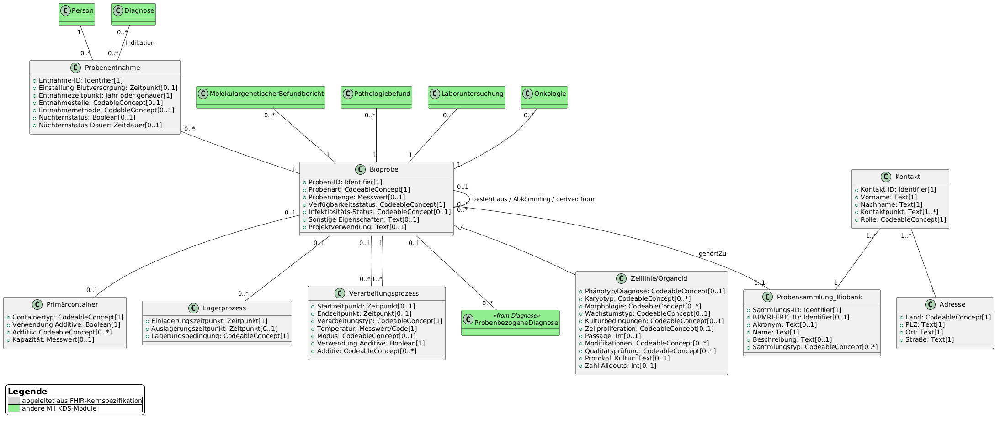

# UML Diagrams - MII IG Kerndatensatz-Modul Biobank v2027.0.0-ballot

* [**Table of Contents**](toc.md)
* [**Guidance**](guidance.md)
* **UML Diagrams**

## UML Diagrams

As a more abstract version of an information model and to better illustrate the relations between the domain concepts, a UML class diagram was created. This logical model only serves to represent the data elements and their descriptions. The data types and cardinalities used are not to be regarded as binding — that is conclusively determined by the FHIR profiles.

For better readability, the complete UML diagram is also available [here in full resolution](UML_2027.png).

