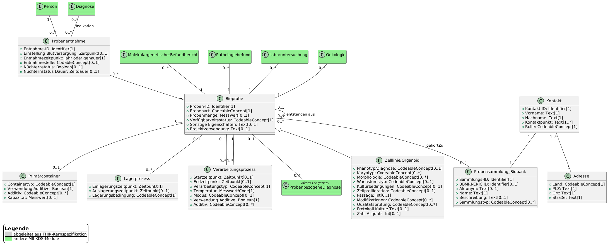

# UML-Diagramme - MII IG Kerndatensatz-Modul Biobank v2027.0.0-ballot.rc2

* [**Inhaltsverzeichnis**](toc.md)
* [**Anleitung**](guidance.md)
* **UML-Diagramme**

## UML-Diagramme

 Diese Seite enthält Übersetzungen aus der Originalsprache, in der der Leitfaden verfasst wurde. Informationen zu diesen Übersetzungen und Anweisungen zum Abgeben von Feedback zu den Übersetzungen finden Sie [hier](translationinfo.md). 

Als abstraktere Version eines Informationsmodells und zur besseren Verdeutlichung von Beziehungen der fachlichen Konzepte untereinander wurde ein UML-Klassendiagramm erstellt. Dieses logische Modell dient nur zur Abbildung der Datenelemente und deren Beschreibungen. Verwendete Datentypen und Kardinalitäten sind nicht als verpflichtend anzusehen. Dies wird abschließend durch die FHIR-Profile festgelegt.

Zur besseren Lesbarkeit findet sich das vollständige UML-Diagramm nochmal [hier in voller Auflösung](UML_28_05_2025.png).

