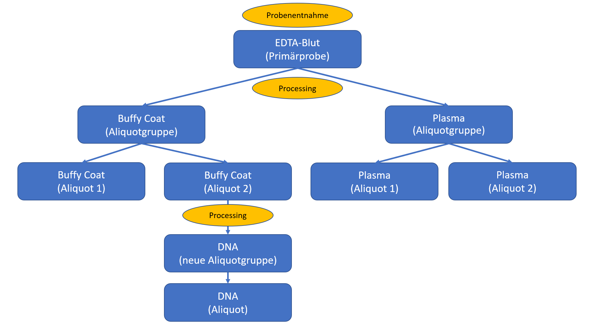

# Glossary - MII IG Kerndatensatz-Modul Biobank v2027.0.0-ballot.rc1

* [**Table of Contents**](toc.md)
* [**Guidance**](guidance.md)
* **Glossary**

## Glossary

This page explains how certain terms are used in the context of this implementation guide. The definitions reflect the consensus of the module team, but may be used differently by individual sites or other groups.

### Primary specimen

Also called stem specimen or master specimen. Refers to the specimen as collected from the donor – before its processing.

Note: In some contexts the aliquot group is also called a master specimen. In the context of the Medical Informatics Initiative, however, a master specimen refers to a primary specimen.

### Aliquot group

A grouping of all aliquots of the same specimen type that derive from the same, possibly already processed, primary specimen.

Specimens that differ in specimen type or primary specimen are counted as different aliquot groups.

For feasibility queries it is recommended to count aliquot groups, not all individual aliquots. An aliquot group counts as available as long as at least one aliquot is available. If primary specimens are frozen directly (e.g. PAX), they shall additionally be marked as an aliquot group so that they can also be counted in feasibility queries.

### Aliquot

A specimen for which identical sibling specimens exist that belong to the same group. If an aliquot is split again, both aliquots remain part of the existing aliquot group. A new group is only created when the process is repeated.

An example of this structuring of specimens is shown here:

-------

### Control specimen

* a) A specimen explicitly collected as a "healthy" specimen together with a "diseased" specimen (matching samples), e.g. healthy tissue next to diseased tissue.
* b) A specimen that can be used within a specific research question to be compared with other specimens explicitly defined as "diseased". The control specimen may originate e.g. from a population cohort or from a collection for another, unrelated disease.

-------

### Derivative

Usually represented as an aliquot group with one to x aliquots.

