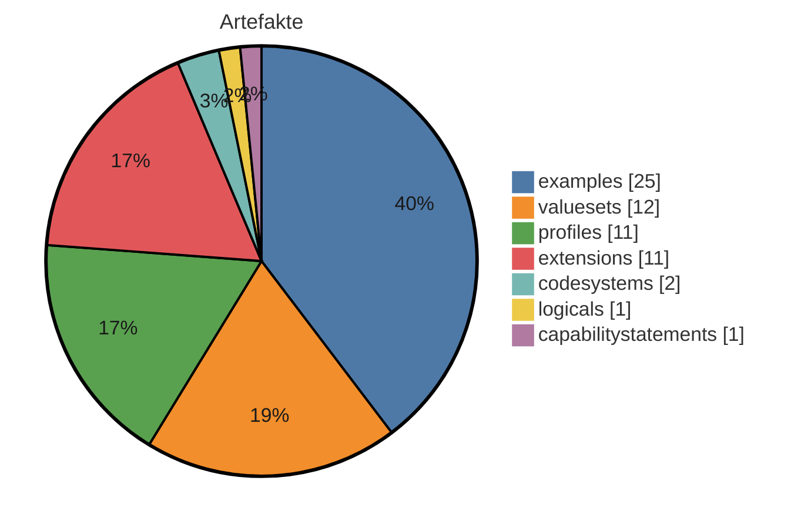
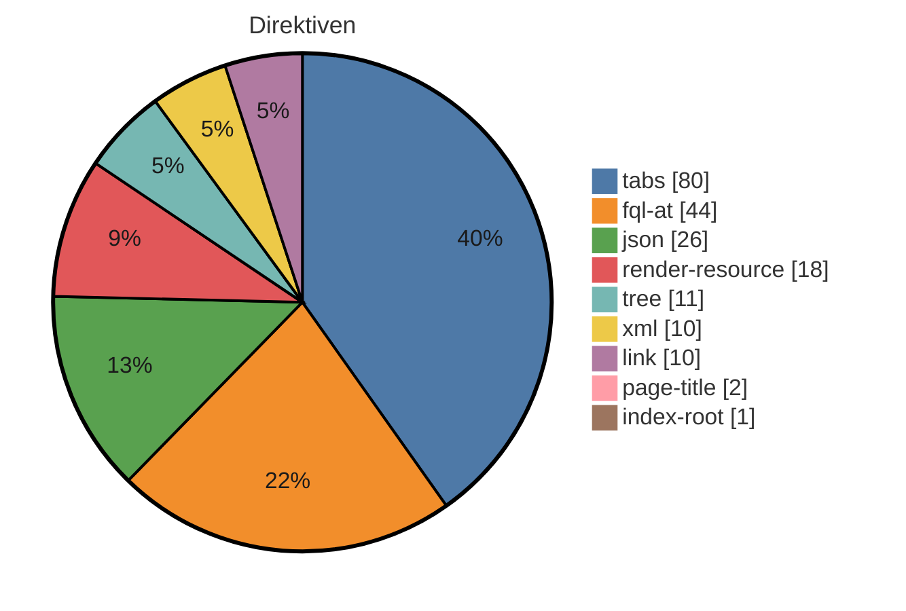

# IG-Statistik — biobank-migrated

_Modus: `static` · Stand: 2026-08-27T17:28:37Z · Commit: `2e8aafb`_

## Kennzahlen-Überblick

### Artefakte (Σ 63 publiziert)

_Hier wird gezählt, wie viele FHIR-Bausteine (Profile, Extensions, ValueSets usw.) der IG je Typ definiert._

<div align="center">



</div>

<div align="center">

| Typ | Anzahl |
|---|---|
| examples | 25 |
| valuesets | 12 |
| profiles | 11 |
| extensions | 11 |
| codesystems | 2 |
| logicals | 1 |
| capabilitystatements | 1 |

</div>

**⚠ Gegenprobe generiert-vs-deklariert** (`fsh-generated/resources`): `examples` deklariert 25 / generiert 21; `other:ConceptMap` deklariert 0 / generiert 4 — für Seiten-/Menü-Entscheidungen ist die generierte resourceType-Zählung maßgeblich; die FSH-Deklarationstypisierung kennt nur InstanceOf-Namen.

_Interne FSH-Konstrukte (nicht in Σ): 65 rulesets, 1 invariants, 1 mappings._

### Plattform-Direktiven — Σ 202 (unbekannt: 0)

_Dieser Abschnitt listet die plattformspezifischen Platzhalter in den Erklärseiten, die ein generischer IG Publisher nicht versteht und die daher umgesetzt werden müssen._

<div align="center">



</div>

<div align="center">

| Direktive | Anzahl |
|---|---|
| tabs | 80 |
| fql-at | 44 |
| json | 26 |
| render-resource | 18 |
| tree | 11 |
| xml | 10 |
| link | 10 |
| page-title | 2 |
| index-root | 1 |

</div>

## Inhaltsumfang & Repo-Hygiene

_Linguistische Kennzahlen zum Textumfang (Wörter je Seite, Durchschnitt) sowie Hinweise auf inhaltliche Dopplungen und nicht referenzierte Dateien (Dead-Code-Analogie) - hilft, Umfang und Aufräumpotenzial einzuschätzen._

<div align="center">

| Kennzahl | Wert |
|---|---|
| Inhalts-Seiten | 47 |
| Wörter gesamt | 15317 |
| Ø Wörter / Seite | 325,9 |
| Median Wörter / Seite | 154 |
| kürzeste / längste Seite | 40 / 2453 Wörter |
| doppelte Inhaltsblöcke | 5 |
| identische Seiten (Gruppen) | 0 |
| Bilder nicht referenziert | 1 von 6 |
| Beispiele nicht in Narrativen | 0 von 25 |

</div>

_Heuristik: 'nicht referenziert' = Dateiname/Artefaktname kommt in keiner Erklärseite vor. Kein Beweis für Ungenutztheit (Referenz kann über Konfiguration/Build erfolgen)._

## Reife-Komponenten (gezählt)

_Gezählte Reife-Komponenten nebeneinander: Status, Vollständigkeit der Dokumentation, Beispiel-Abdeckung der Profile und Governance-Merkmale. Bewusst kein verdichteter Score und kein Freigabe-Urteil — die Einordnung bleibt menschlich._

<div align="center">

| Komponente | Wert |
|---|---|
| Status | active |
| Doku-Vollständigkeit (Inhalt vs. Stubs) | 96 % |
| Beispiel-Abdeckung Profile | 91 % (10/11) |
| Governance (CI · ig.ini · publication · devcontainer) | 100/100 |

</div>

**Profile ohne Beispiel (1):** `MII_PR_Biobank_Specimen_Bioprobe_Core`

## Strategie: Wiederverwendung, Lock-in & Zukunftssicherheit

_Strategische Kennzahlen: Bindung an die Quellplattform (Lock-in), Anteil standardisierter Terminologie, Wiederverwendung externer Bausteine und Zukunftssicherheit (FHIR-Version, Pflege-Aktivität)._

<div align="center">

| Kennzahl | Wert |
|---|---|
| Hersteller-Lock-in | 52/100 (mittel) · 4,3 Direktiven/Seite |
| Standard-Terminologie-Anteil | 99 % (SNOMED CT, LOINC, ICD-10, UCUM) |
| Wiederverwendung externer Profile (Parents) | 82 % (9 von 11 Profil-Parents extern; abstrakte LM-Basistypen ausgeschlossen) |
| FHIR-Version | R4 — aktuell verbreitet |
| Dependency-Veraltung | 0 veraltet (Heuristik) |
| Pflege-Kadenz | 52.8 Commits/Jahr · letzter Commit vor 0 Tagen |

</div>

_Lock-in und Standard-Terminologie-Anteil sind grobe Heuristiken aus Textvorkommen. Heuristik aus CalVer-Jahr; exakt nur via Package-Registry (extern)._

## Risiko & Compliance

_Entscheidungsrelevante Risiken für die Freigabe: Terminologie-Lizenzen, unterdrückte Warnungen, Datenschutz-Substanz, Wissenskonzentration (Bus-Faktor) und Kompatibilitätsbruch zur Vorversion._

<div align="center">

| Risiko | Bewertung |
|---|---|
| Terminologie-Lizenz | Lizenzbedarf möglich — SNOMED CT: lizenzpflichtig (Affiliate/Land), LOINC: frei (Registrierung), ICD-10: frei, UCUM: frei |
| Unterdrückte QA-Warnungen | 8 (davon 0 breit) → gering |
| Datenschutz-Seite (Substanz) | fehlt/nur Stub (0 Wörter) |
| PII-artige Beispieldaten | keine erkannt |
| Bus-Faktor (Wissenskonzentration) | 61 % Top-Autor → mittel |
| Breaking-Change-Risiko ggü. Vorversion | — (nur per Build/Vorversions-Diff) |

</div>

## Befunde & Einordnung

_Je Themenbereich der gemessene Befund und eine neutrale Einordnung, was er über den Guide aussagt — keine Handlungs- oder Migrationsanweisungen._

<div align="center">

| Bereich | Befund | Einordnung |
|---|---|---|
| Artefakte (FSH) | 63 publiziert, FSH vorhanden | Zählt die publizierten Konformitätsressourcen und ob FSH-Quelltext vorliegt. FSH-Quellen machen den Bestand direkt les-, diff- und weiterverarbeitbar; ohne sie ist nur das generierte JSON/XML die Quelle. |
| Narrative | 47 Inhalts-Seiten, Format target | Anzahl und Format der Erklärseiten (source = Plattformformat, target = IG-Publisher-Format). Das Format bestimmt, welche Werkzeuge die Seiten unverändert verarbeiten können. |
| Direktiven | 202 (0 unbekannt) | Vorkommen plattformspezifischer Platzhalter/Tags, die nur die Quellplattform interpretiert. Je mehr davon, desto stärker ist die Darstellung an die Plattform gebunden (vgl. Lock-in-Kennzahl). |
| Dependencies | 6 (0 floating) | Deklarierte Paket-Abhängigkeiten und ihr Pinning. Floating-Einträge folgen automatisch neuen Versionen und machen Builds weniger reproduzierbar — der Wert zeigt, wie reproduzierbar der aktuelle Stand ist. |
| Mehrsprachigkeit | FSH-Übersetzung ja, Supplements 0 | Ob Übersetzungen in den FSH-Quellen (translation-Extensions) und/oder als Publisher-Supplements vorliegen. Die beiden Mechanismen decken unterschiedliche Textarten ab; der Wert zeigt den vorhandenen Stand, nicht den Bedarf. |
| Pflichtseiten | 13/13 im Zielformat | Wie viele Seiten des hinterlegten Pflicht-Rasters (mandatory_pages in dieser Datei) im Zielformat existieren. Die Aussagekraft hängt vom Raster ab: Nutzt ein Guide legitim ein anderes Seitenraster, wird das Raster korrigiert — nicht die Seiten als fehlend gewertet. |
| QC-Regeln | 12 definiert | Anzahl der im Projekt definierten Qualitätsregeln (qc/custom.rules.yaml). Statisch wird nur die Definition gezählt; Verletzungen zeigt erst der Qualitätslauf eines Builds. |
| Metadaten/Config | id mii-ig-biobank-de-v2026, v2026.0.1 | Kern-Identität (id, Version) wie in sushi-config.yaml/package.json deklariert; die vollständigen Identitätsfelder stehen im Anhang. |

</div>

## Direktiven-Mapping (Detail)

_Dieser Abschnitt ordnet jedem Direktiven-Typ sein dokumentiertes Standard-Gegenstück im IG-Publisher-Format zu — eine Faktenreferenz, kein Arbeitsauftrag; sortiert nach Häufigkeit._

<div align="center">

| Direktive | Anzahl | Was es tut | Standard-Gegenstück (IG Publisher) |
|---|---|---|---|
| tabs | 80 | Gruppiert mehrere Inhalte (z.B. Darstellung, XML, JSON) in umschaltbare Reiter. | Die einzelnen Reiterinhalte durch die jeweils passenden generierten Anzeige-Fragmente (Struktur, XML, JSON) ersetzen; eine eigene Reiter-Mechanik ist meist nicht nötig. |
| fql-at | 44 | Markiert einen Abfrage-Codeblock in besonderer Schreibweise (mit @-Präfix). | Wie einen normalen Abfrageblock behandeln und durch ein generiertes Tabellen-Fragment oder eine statische Tabelle ersetzen. |
| json | 26 | Zeigt eine Ressource oder ein Beispiel in JSON-Darstellung an. | Durch das vom IG Publisher erzeugte JSON-Anzeige-Fragment ersetzen. |
| render-resource | 18 | Rendert eine vollständige FHIR-Ressource (z.B. ein CapabilityStatement) in die Seite hinein. | Meist entfernen, da der IG Publisher für jedes Artefakt automatisch eine eigene Seite erzeugt; alternativ das passende vorgefertigte Anzeige-Fragment einbinden. |
| tree | 11 | Zeigt die Struktur eines Profils/einer Extension als aufklappbaren Strukturbaum an. | Durch das vom IG Publisher erzeugte Struktur-Fragment ersetzen (Snapshot- oder Differential-Ansicht bzw. Element-Wörterbuch). |
| xml | 10 | Zeigt eine Ressource oder ein Beispiel in XML-Darstellung an. | Durch das vom IG Publisher erzeugte XML-Anzeige-Fragment ersetzen. |
| link | 10 | Erzeugt einen Verweis auf ein einzelnes Artefakt (z.B. dessen Übersichtsseite). | Durch einen normalen Markdown-Link auf die generierte Artefaktseite ersetzen (Form Typ-id.html). |
| page-title | 2 | Setzt an dieser Stelle den Titel der Seite, der aus den Seiteneinstellungen gezogen wird. | Entfällt ersatzlos - Seitentitel und Überschrift steuert man zentral über die Seiten- und Menükonfiguration. |
| index-root | 1 | Erzeugt an dieser Stelle ein automatisches Inhaltsverzeichnis bzw. die Wurzel der Navigationsstruktur. | Entfällt - Navigation und Inhaltsverzeichnis erzeugt der IG Publisher selbst aus der konfigurierten Seitenstruktur. |

</div>

# Anhang: Detailaufschlüsselung

_Im Anhang steht jeder Einzelwert mit seiner Quelle, damit man die Kennzahlen nachvollziehen kann, ohne im Projekt suchen zu müssen._

## Identität & Herkunft

<div align="center">

| Feld | Wert | Quelle |
|---|---|---|
| id | mii-ig-biobank-de-v2026 | sushi-config.yaml / package.json |
| canonical | https://www.medizininformatik-initiative.de/fhir/ext/modul-biobank | sushi-config.yaml / package.json |
| packageId | de.medizininformatikinitiative.kerndatensatz.biobank | sushi-config.yaml / package.json |
| name | MII_IG_Biobank_DE | sushi-config.yaml / package.json |
| title | MII IG Kerndatensatz-Modul Biobank | sushi-config.yaml / package.json |
| version | 2026.0.1 | sushi-config.yaml / package.json |
| status | active | sushi-config.yaml / package.json |
| fhirVersion | 4.0.1 | sushi-config.yaml / package.json |
| license | CC-BY-4.0 | sushi-config.yaml / package.json |
| publisher | Medizininformatik Initiative | sushi-config.yaml / package.json |
| calver | True | version-Regex |

</div>

## Dependencies

_Die FHIR-Pakete, auf denen der IG aufbaut, samt Version und ob diese fest oder offen angegeben ist._

<div align="center">

| Package | Version | Pin |
|---|---|---|
| de.basisprofil.r4 | 1.5.4 | gepinnt |
| de.medizininformatikinitiative.kerndatensatz.meta | 2026.0.0 | gepinnt |
| eu.miabis.r4 | 0.2.0 | gepinnt |
| hl7.fhir.uv.crmi | 2.0.0 | gepinnt |
| hl7.terminology.r4 | 7.3.0 | gepinnt |
| hl7.fhir.uv.extensions.r4 | 5.3.0 | gepinnt |

</div>

## Pre-flight (Migration Gate 0)

- Lizenz-Evidenz: sushi-config.yaml/package.json → CC-BY-4.0; input/pagecontent/metadata.md → CC-BY-4.0

- Canonical-Raum: 1 außerhalb + 10 id/url-abweichend → special-url-Prognose: 13

- Dependency-Gesundheit: old-style=keine; THO direkt gepinnt=True, Extensions-Pack=True; externe Parents: 0

- Narrative-Quellen: **DUAL** — implementation-guides/ (letzter Commit 2026-02-11T16:33:25+01:00) UND pagecontent+intro-notes (letzter Commit 2026-08-27T19:28:20+02:00); vor der Migration entscheiden, welche Kopie maßgeblich ist (Frische, nicht Rang)

- QA-Baseline: **keine im Baum** — für Vorher/Nachher-Beweise die unmigrierte Quelle bauen oder deren gerendertes qa beziehen

## Artefakte (Quelle: input/fsh (FSH-Deklarationen))

_Jedes definierte Artefakt mit Typ, Name und Fundort in den Quelldateien._

<div align="center">

| Typ | Name | InstanceOf | Quelle |
|---|---|---|---|
| RuleSet | SupportResource |  | input/fsh/CapabilityStatement.fsh:1 |
| RuleSet | Profile |  | input/fsh/CapabilityStatement.fsh:6 |
| RuleSet | SupportProfile |  | input/fsh/CapabilityStatement.fsh:11 |
| RuleSet | SupportInteraction |  | input/fsh/CapabilityStatement.fsh:17 |
| RuleSet | SupportSearchParam |  | input/fsh/CapabilityStatement.fsh:23 |
| Instance | mii-cps-biobank-capabilitystatement | CapabilityStatement | input/fsh/CapabilityStatement.fsh:31 |
| CodeSystem | MII_CS_Biobank_Contact_Type |  | input/fsh/codesystems/CodeSystemContactType.fsh:1 |
| CodeSystem | MII_CS_Biobank_Probenebene |  | input/fsh/codesystems/CodeSystemProbenebene.fsh:1 |
| Instance | mii-cm-biobank-fixation-type-sprec-sct | http://hl7.org/fhir/StructureDefinition/ConceptMap | input/fsh/conceptmaps/SPRECFixationTypeMap.fsh:1 |
| Instance | mii-cm-biobank-long-term-storage-sprec-sct | http://hl7.org/fhir/StructureDefinition/ConceptMap | input/fsh/conceptmaps/SPRECLongTermStorageMap.fsh:1 |
| Instance | mii-cm-biobank-primary-container-sprec-sct | http://hl7.org/fhir/StructureDefinition/ConceptMap | input/fsh/conceptmaps/SPRECPrimaryContainerMap.fsh:1 |
| Instance | mii-cm-biobank-sample-type-sprec-sct | http://hl7.org/fhir/StructureDefinition/ConceptMap | input/fsh/conceptmaps/SPRECSampleTypeMap.fsh:1 |
| Extension | MII_EX_Biobank_Anzahl_Aliquots |  | input/fsh/extensions/ExtensionAnzahlAliquots.fsh:2 |
| Extension | MII_EX_Biobank_Diagnose |  | input/fsh/extensions/ExtensionDiagnose.fsh:2 |
| Extension | MII_EX_Biobank_Ebene |  | input/fsh/extensions/ExtensionEbene.fsh:2 |
| Extension | MII_EX_Biobank_Einstellung_Blutversorgung |  | input/fsh/extensions/ExtensionEinstellungBlutversorgung.fsh:2 |
| Extension | MII_EX_Biobank_KontaktRolle |  | input/fsh/extensions/ExtensionKontaktRolle.fsh:2 |
| Extension | MII_EX_Biobank_Kulturprotokoll |  | input/fsh/extensions/ExtensionKulturprotokoll.fsh:2 |
| Extension | MII_EX_Biobank_Modifikationen |  | input/fsh/extensions/ExtensionModifikationen.fsh:2 |
| Extension | MII_EX_Biobank_Feature_R5 |  | input/fsh/extensions/ExtensionR5Feature.fsh:1 |
| Extension | MII_EX_Biobank_Temperaturbedingungen |  | input/fsh/extensions/ExtensionTemperaturbedingungen.fsh:2 |
| Extension | MII_EX_Biobank_Verwaltende_Organisation |  | input/fsh/extensions/ExtensionVerwaltendeOrganisation.fsh:2 |
| Extension | MII_EX_Biobank_Anzahl_Passagen |  | input/fsh/extensions/ExtensionZahlPassagen.fsh:2 |
| Instance | AliquotBuffyCoat2 | MII_PR_Biobank_Specimen_Bioprobe | input/fsh/instances/Aliqout2_BuffyCoat.fsh:1 |
| Instance | AliquotgruppeBuffyCoat | MII_PR_Biobank_Specimen_Bioprobe | input/fsh/instances/Aliqoutgruppe_BuffyCoat.fsh:1 |
| Instance | AliquotgruppePlasma | MII_PR_Biobank_Specimen_Bioprobe | input/fsh/instances/Aliqoutgruppe_Plasma.fsh:1 |
| Instance | AliquotBuffyCoat1 | MII_PR_Biobank_Specimen_Bioprobe | input/fsh/instances/Aliquot1_BuffyCoat.fsh:1 |
| Instance | AliquotgruppeDNA | MII_PR_Biobank_Specimen_Bioprobe | input/fsh/instances/Aliquotgruppe_DNA.fsh:1 |
| Instance | BiobankMusterstadt | MII_PR_Biobank_Organization_Sammlung_Biobank | input/fsh/instances/BiobankMusterstadt.fsh:1 |
| Instance | DNAConcentrationObs1 | MII_PR_Biobank_Observation_DNA_Konzentration | input/fsh/instances/DNAKonzentration.fsh:1 |
| Instance | Heparin | MII_PR_Biobank_Substance_Additiv | input/fsh/instances/Heparin.fsh:1 |
| Instance | KaryotypOrganoidLunge | MII_PR_Biobank_Observation_Karyotyp | input/fsh/instances/Karyotyp.fsh:1 |
| Instance | Kulturprotokoll | DocumentReference | input/fsh/instances/Kulturprotokoll.fsh:1 |
| Instance | ProtocolCRISPRTP53 | DocumentReference | input/fsh/instances/ModifikationProtokoll.fsh:1 |
| Instance | MorphologieOrganoidLunge | MII_PR_Biobank_Observation_Morphologie | input/fsh/instances/MorphologieOrganoid.fsh:1 |
| Instance | MusterprobeFluessig | MII_PR_Biobank_Specimen_Bioprobe | input/fsh/instances/MusterprobeFluessig.fsh:1 |
| Instance | MusterprobeGewebe | MII_PR_Biobank_Specimen_Bioprobe | input/fsh/instances/MusterprobeGewebe.fsh:1 |
| Instance | Mustersammlung | MII_PR_Biobank_Organization_Sammlung_Biobank | input/fsh/instances/Mustersammlung.fsh:1 |
| Instance | OrganoidLunge | MII_PR_Biobank_Specimen_Zellinie_Organoid | input/fsh/instances/Organoid_lunge.fsh:1 |
| Instance | ProliferationOrganoidLunge | MII_PR_Biobank_Observation_Proliferation | input/fsh/instances/Proliferation.fsh:1 |
| Instance | QualitaetspruefungBuffyCoat | MII_PR_Biobank_Observation_Qualitaetspruefung | input/fsh/instances/Qualitaetspruefung_BuffyCoat.fsh:1 |
| Instance | QualitaetspruefungPlasma | MII_PR_Biobank_Observation_Qualitaetspruefung | input/fsh/instances/Qualitaetspruefung_Plasma.fsh:1 |
| Instance | GewebeBiopsie | ServiceRequest | input/fsh/instances/ServiceRequest.fsh:1 |
| Instance | WachstumstypOrganoidLunge | MII_PR_Biobank_Observation_Wachstumstyp | input/fsh/instances/Wachstumstyp.fsh:1 |
| Invariant | mii-bb-1 |  | input/fsh/invariants/mii-bb-1.fsh:1 |
| Logical | MII_LM_Biobank |  | input/fsh/logicals/MII_LM_Biobank.fsh:1 |
| Mapping | MII_LM_Biobank |  | input/fsh/logicals/MII_LM_Biobank.fsh:80 |
| Profile | MII_PR_Biobank_Observation_DNA_Konzentration |  | input/fsh/profiles/ProfileObservationDNAKonzentration.fsh:2 |
| Profile | MII_PR_Biobank_Observation_Karyotyp |  | input/fsh/profiles/ProfileObservationKaryotyp.fsh:2 |
| Profile | MII_PR_Biobank_Observation_Proliferation |  | input/fsh/profiles/ProfileObservationProliferation.fsh:2 |
| Profile | MII_PR_Biobank_Observation_Qualitaetspruefung |  | input/fsh/profiles/ProfileObservationQualitaetspruefung.fsh:2 |
| Profile | MII_PR_Biobank_Observation_Wachstumstyp |  | input/fsh/profiles/ProfileObservationWachstumstyp.fsh:2 |
| Profile | MII_PR_Biobank_Observation_Morphologie |  | input/fsh/profiles/ProfileObservationZellMorphologie.fsh:2 |
| Profile | MII_PR_Biobank_Organization_Sammlung_Biobank |  | input/fsh/profiles/ProfileOrganizationSammlungBiobank.fsh:2 |
| Profile | MII_PR_Biobank_Specimen_Bioprobe |  | input/fsh/profiles/ProfileSpecimenBioprobe.fsh:2 |
| Profile | MII_PR_Biobank_Specimen_Bioprobe_Core |  | input/fsh/profiles/ProfileSpecimenBioprobeCore.fsh:2 |
| Profile | MII_PR_Biobank_Specimen_Zellinie_Organoid |  | input/fsh/profiles/ProfileSpecimenZellinieOrganiod.fsh:2 |
| Profile | MII_PR_Biobank_Substance_Additiv |  | input/fsh/profiles/ProfileSubstanceAdditiv.fsh:2 |
| RuleSet | AddMapping |  | input/fsh/rulesets/ConceptMapRuleSets.fsh:1 |
| RuleSet | AddAdditiveMapping |  | input/fsh/rulesets/ConceptMapRuleSets.fsh:6 |
| RuleSet | InitMapping |  | input/fsh/rulesets/ConceptMapRuleSets.fsh:11 |
| RuleSet | AddComment |  | input/fsh/rulesets/ConceptMapRuleSets.fsh:15 |
| RuleSet | SNOMED_Copyright |  | input/fsh/rulesets/copyright.fsh:1 |
| RuleSet | LOINC_Copyright |  | input/fsh/rulesets/copyright.fsh:4 |
| RuleSet | UCUM_Copyright |  | input/fsh/rulesets/copyright.fsh:7 |
| RuleSet | SNOMED_SPREC_Copyright_CM |  | input/fsh/rulesets/copyright.fsh:10 |
| RuleSet | SupportSpecialSearchParam |  | input/fsh/rulesets/cps-rules.fsh:20 |
| RuleSet | CRMIVersionPolicyStrict |  | input/fsh/rulesets/crmi.fsh:25 |
| RuleSet | CRMIVersionPolicyStrictInstance |  | input/fsh/rulesets/crmi.fsh:29 |
| RuleSet | CRMICopyrightLabel |  | input/fsh/rulesets/crmi.fsh:39 |
| RuleSet | CRMICopyrightLabelInstance |  | input/fsh/rulesets/crmi.fsh:43 |
| RuleSet | CRMIApprovalDate |  | input/fsh/rulesets/crmi.fsh:50 |
| RuleSet | CRMIApprovalDateInstance |  | input/fsh/rulesets/crmi.fsh:54 |
| RuleSet | CRMIArtifactTopic |  | input/fsh/rulesets/crmi.fsh:64 |
| RuleSet | CRMIArtifactTopicInstance |  | input/fsh/rulesets/crmi.fsh:68 |
| RuleSet | CRMIArtifactContributors |  | input/fsh/rulesets/crmi.fsh:78 |
| RuleSet | CRMIArtifactContributorsInstance |  | input/fsh/rulesets/crmi.fsh:101 |
| RuleSet | CRMIShareableStructureDefinition |  | input/fsh/rulesets/crmi.fsh:126 |
| RuleSet | CRMIPublishableStructureDefinition |  | input/fsh/rulesets/crmi.fsh:129 |
| RuleSet | CRMIKnowledgeCapabilitiesStructureDefinition |  | input/fsh/rulesets/crmi.fsh:132 |
| RuleSet | CRMIArtifactUsageLogicalModel |  | input/fsh/rulesets/crmi.fsh:138 |
| RuleSet | CRMIArtifactUsageProfile |  | input/fsh/rulesets/crmi.fsh:142 |
| RuleSet | CRMIArtifactUsageExtension |  | input/fsh/rulesets/crmi.fsh:146 |
| RuleSet | CRMIShareableCapabilityStatement |  | input/fsh/rulesets/crmi.fsh:152 |
| RuleSet | CRMIPublishableCapabilityStatement |  | input/fsh/rulesets/crmi.fsh:155 |
| RuleSet | CRMIKnowledgeCapabilitiesCapabilityStatement |  | input/fsh/rulesets/crmi.fsh:158 |
| RuleSet | CRMIArtifactUsageCapabilityStatement |  | input/fsh/rulesets/crmi.fsh:164 |
| RuleSet | CRMIShareableCodeSystem |  | input/fsh/rulesets/crmi.fsh:170 |
| RuleSet | CRMIPublishableCodeSystem |  | input/fsh/rulesets/crmi.fsh:173 |
| RuleSet | CRMIKnowledgeCapabilitiesCodeSystem |  | input/fsh/rulesets/crmi.fsh:176 |
| RuleSet | CRMIKnowledgeCapabilitiesCodeSystemPublishable |  | input/fsh/rulesets/crmi.fsh:182 |
| RuleSet | CRMIShareableValueSet |  | input/fsh/rulesets/crmi.fsh:188 |
| RuleSet | CRMIPublishableValueSet |  | input/fsh/rulesets/crmi.fsh:191 |
| RuleSet | CRMIComputableValueSet |  | input/fsh/rulesets/crmi.fsh:194 |
| RuleSet | CRMIKnowledgeCapabilitiesValueSet |  | input/fsh/rulesets/crmi.fsh:197 |
| RuleSet | PR_CS_VS_Date |  | input/fsh/rulesets/date.fsh:1 |
| RuleSet | Date |  | input/fsh/rulesets/date.fsh:4 |
| RuleSet | ExtensionContext |  | input/fsh/rulesets/extension-context.fsh:1 |
| RuleSet | LicenseCodeableCCBY40 |  | input/fsh/rulesets/license-terms.fsh:3 |
| RuleSet | LicenseCodeableCCBY40Instance |  | input/fsh/rulesets/license-terms.fsh:7 |
| RuleSet | LicenseCodeableCC0 |  | input/fsh/rulesets/license-terms.fsh:12 |
| RuleSet | SnomedLicense |  | input/fsh/rulesets/license.fsh:12 |
| RuleSet | MetaProfile |  | input/fsh/rulesets/meta-profile.fsh:1 |
| RuleSet | Publisher |  | input/fsh/rulesets/publisher.fsh:1 |
| RuleSet | SP_Publisher |  | input/fsh/rulesets/publisher.fsh:6 |
| RuleSet | TestDataLabel |  | input/fsh/rulesets/test-data-label.fsh:14 |
| RuleSet | Translation |  | input/fsh/rulesets/translation.fsh:1 |
| RuleSet | AddSnomedCodingTranslation |  | input/fsh/rulesets/translation.fsh:9 |
| RuleSet | AddIcd10CodingTranslation |  | input/fsh/rulesets/translation.fsh:17 |
| RuleSet | AddAlphaIdCodingTranslation |  | input/fsh/rulesets/translation.fsh:25 |
| RuleSet | AddOrphaCodingTranslation |  | input/fsh/rulesets/translation.fsh:33 |
| RuleSet | AddOpsCodingTranslation |  | input/fsh/rulesets/translation.fsh:41 |
| RuleSet | Version |  | input/fsh/rulesets/version.fsh:2 |
| RuleSet | PR_CS_VS_Version |  | input/fsh/rulesets/version.fsh:5 |
| RuleSet | CRMIPackageSource |  | input/fsh/rulesets/version.fsh:16 |
| RuleSet | CRMIPackageSourceDefinitionalResource |  | input/fsh/rulesets/version.fsh:25 |
| RuleSet | CRMIResourceEffectivePeriod |  | input/fsh/rulesets/version.fsh:39 |
| RuleSet | CRMIResourceEffectivePeriodInstance |  | input/fsh/rulesets/version.fsh:43 |
| ValueSet | MII_VS_Biobank_Substance_Additive_SCT |  | input/fsh/valuesets/ValueSetAdditive.fsh:1 |
| ValueSet | MII_VS_Biobank_Cellline_Morphology_SCT |  | input/fsh/valuesets/ValueSetCellLineMorphologie.fsh:1 |
| ValueSet | MII_VS_Biobank_CellLine_Proliferation |  | input/fsh/valuesets/ValueSetCellinieProliferation.fsh:1 |
| ValueSet | MII_VS_Biobank_Containertyp_SCT |  | input/fsh/valuesets/ValueSetContainertyp.fsh:1 |
| ValueSet | MII_VS_Biobank_DNA_Concentration_Units_UCUM |  | input/fsh/valuesets/ValueSetDNAKonzentrationUnits.fsh:1 |
| ValueSet | MII_VS_Biobank_Karyotyp_SCT |  | input/fsh/valuesets/ValueSetKaryotyp.fsh:1 |
| ValueSet | MII_VS_Biobank_Cellline_Modification_CLO |  | input/fsh/valuesets/ValueSetModifikationen.fsh:1 |
| ValueSet | MII_VS_Biobank_Probenart_SCT |  | input/fsh/valuesets/ValueSetProbenart.fsh:1 |
| ValueSet | MII_VS_Biobank_Probenebene |  | input/fsh/valuesets/ValueSetProbenebene.fsh:1 |
| ValueSet | MII_VS_Biobank_BodyStructures_SCT |  | input/fsh/valuesets/ValueSetSCTBodyStructure.fsh:1 |
| ValueSet | MII_VS_Biobank_Laboratory_Procedure_SCT |  | input/fsh/valuesets/ValueSetSCTLaboratoryProcedure.fsh:1 |
| ValueSet | MII_VS_Biobank_Wachstumpstyp_CLO |  | input/fsh/valuesets/ValueSetWachstumstyp.fsh:1 |

</div>

## Narrative-Seiten (47 Inhalt / 49 gesamt)

_Die Erklärseiten des IG mit Umfang und der Angabe, ob es sich um Inhalts- oder reine Platzhalterseiten handelt._

<div align="center">

| Datei | Wörter | Format | Stub? |
|---|---|---|---|
| input/pagecontent/metadata.md | 2453 | target |  |
| input/translations/de/pagecontent/metadata.md | 2178 | translation |  |
| input/pagecontent/code-systems.md | 1136 | target |  |
| implementation-guides/mii-ig-biobanken-de-v2026/MIIIGModulBiobank/TechnischeImplementierung/Terminologien.page.md | 1121 | source |  |
| input/translations/de/pagecontent/code-systems.md | 1087 | translation |  |
| input/pagecontent/logical-models.md | 950 | target |  |
| input/translations/de/pagecontent/logical-models.md | 918 | translation |  |
| input/pagecontent/index.md | 800 | target |  |
| input/translations/de/pagecontent/index.md | 718 | translation |  |
| input/pagecontent/security-and-privacy.md | 596 | target |  |
| input/pagecontent/version-history.md | 596 | target |  |
| input/pagecontent/profiles.md | 581 | target |  |
| input/translations/de/pagecontent/version-history.md | 546 | translation |  |
| input/translations/de/pagecontent/profiles.md | 540 | translation |  |
| input/pagecontent/implementer-guidance.md | 501 | target |  |
| input/translations/de/pagecontent/security-and-privacy.md | 494 | translation |  |
| input/translations/de/pagecontent/implementer-guidance.md | 472 | translation |  |
| input/pagecontent/downloads.md | 440 | target |  |
| input/pagecontent/ImplementationGuide-mii-ig-biobank-de-v2026.md | 423 | target |  |
| input/translations/de/pagecontent/downloads.md | 408 | translation |  |
| input/pagecontent/extensions.md | 397 | target |  |
| implementation-guides/mii-ig-biobanken-de-v2026/MIIIGModulBiobank/BeschreibungModul.page.md | 382 | source |  |
| implementation-guides/mii-ig-biobanken-de-v2026/MIIIGModulBiobank/Index.page.md | 374 | source |  |
| input/translations/de/pagecontent/extensions.md | 373 | translation |  |
| input/translations/de/pagecontent/ImplementationGuide-mii-ig-biobank-de-v2026.md | 344 | translation |  |
| input/pagecontent/glossary.md | 338 | target |  |
| implementation-guides/mii-ig-biobanken-de-v2026/MIIIGModulBiobank/Referenzen.page.md | 305 | source |  |
| input/translations/de/pagecontent/glossary.md | 290 | translation |  |
| implementation-guides/mii-ig-biobanken-de-v2026/MIIIGModulBiobank/TechnischeImplementierung/FHIR-Profile/Organization/Index.page.md | 251 | source |  |
| input/pagecontent/guidance.md | 226 | target |  |
| implementation-guides/mii-ig-biobanken-de-v2026/MIIIGModulBiobank/TechnischeImplementierung/FHIR-Profile/Specimen/Index.page.md | 218 | source |  |
| input/translations/de/pagecontent/guidance.md | 192 | translation |  |
| input/pagecontent/changes.md | 188 | target |  |
| implementation-guides/mii-ig-biobanken-de-v2026/MIIIGModulBiobank/TechnischeImplementierung/FHIR-Profile/ZelllinieOrganoid/Index.page.md | 185 | source |  |
| implementation-guides/mii-ig-biobanken-de-v2026/MIIIGModulBiobank/Release-Notes.page.md | 165 | source |  |
| implementation-guides/mii-ig-biobanken-de-v2026/MIIIGModulBiobank/KontextimGesamtprojektBezgezuanderenModulen.page.md | 164 | source |  |
| input/translations/de/pagecontent/changes.md | 164 | translation |  |
| implementation-guides/mii-ig-biobanken-de-v2026/MIIIGModulBiobank/TechnischeImplementierung/FHIR-Profile/Specimen/Extensions.page.md | 154 | source |  |
| implementation-guides/mii-ig-biobanken-de-v2026/MIIIGModulBiobank/TechnischeImplementierung/FHIR-Profile/SubstanceAdditiv.page.md | 147 | source |  |
| implementation-guides/mii-ig-biobanken-de-v2026/MIIIGModulBiobank/AnwendungsfaelleInformationsmodell/DatensaetzeinklBeschreibungen.page.md | 145 | source |  |
| implementation-guides/mii-ig-biobanken-de-v2026/MIIIGModulBiobank/TechnischeImplementierung/FHIR-Profile/Specimen/Qualitaetspruefung.page.md | 139 | source |  |
| input/intro-notes/StructureDefinition-mii-pr-biobank-organization-intro.md | 135 | intro |  |
| implementation-guides/mii-ig-biobanken-de-v2026/MIIIGModulBiobank/TechnischeImplementierung/FHIR-Profile/Specimen/DNAKonzentration.page.md | 128 | source |  |
| implementation-guides/mii-ig-biobanken-de-v2026/MIIIGModulBiobank/TechnischeImplementierung/FHIR-Profile/ZelllinieOrganoid/Karyotyp.page.md | 128 | source |  |
| implementation-guides/mii-ig-biobanken-de-v2026/MIIIGModulBiobank/TechnischeImplementierung/FHIR-Profile/ZelllinieOrganoid/Morphologie.page.md | 128 | source |  |
| implementation-guides/mii-ig-biobanken-de-v2026/MIIIGModulBiobank/TechnischeImplementierung/FHIR-Profile/ZelllinieOrganoid/Proliferation.page.md | 128 | source |  |
| implementation-guides/mii-ig-biobanken-de-v2026/MIIIGModulBiobank/TechnischeImplementierung/FHIR-Profile/ZelllinieOrganoid/Wachstumstyp.page.md | 128 | source |  |
| input/pagecontent/examples.md | 126 | target |  |
| implementation-guides/mii-ig-biobanken-de-v2026/MIIIGModulBiobank/AnwendungsfaelleInformationsmodell/BeschreibungvonSzenarienfrdieAnwendungderModule.page.md | 125 | source |  |
| input/pagecontent/uml-diagrams.md | 121 | target |  |
| implementation-guides/mii-ig-biobanken-de-v2026/MIIIGModulBiobank/TechnischeImplementierung/FHIR-Profile/Index.page.md | 118 | source |  |
| input/pagecontent/capability-statements.md | 106 | target |  |
| input/pagecontent/value-sets.md | 102 | target |  |
| input/translations/de/pagecontent/examples.md | 102 | translation |  |
| input/pagecontent/translationinfo.md | 99 | target |  |
| input/translations/de/pagecontent/translationinfo.md | 92 | translation |  |
| input/translations/de/pagecontent/uml-diagrams.md | 90 | translation |  |
| implementation-guides/mii-ig-biobanken-de-v2026/MIIIGModulBiobank/TechnischeImplementierung/FHIR-Profile/ZelllinieOrganoid/Kulturbedingungen.page.md | 87 | source |  |
| input/translations/de/pagecontent/capability-statements.md | 87 | translation |  |
| implementation-guides/mii-ig-biobanken-de-v2026/MIIIGModulBiobank/TechnischeImplementierung/CapabilityStatement.page.md | 85 | source |  |
| input/translations/de/pagecontent/value-sets.md | 75 | translation |  |
| implementation-guides/mii-ig-biobanken-de-v2026/MIIIGModulBiobank/TechnischeImplementierung/FHIR-Profile/ZelllinieOrganoid/Mutationen.page.md | 64 | source |  |
| implementation-guides/mii-ig-biobanken-de-v2026/MIIIGModulBiobank/AnwendungsfaelleInformationsmodell/UML.page.md | 63 | source |  |
| input/pagecontent/researcher-guidance.md | 59 | target |  |
| implementation-guides/mii-ig-biobanken-de-v2026/MIIIGModulBiobank/TechnischeImplementierung/FHIR-Profile/Organization/Extensions.page.md | 54 | source |  |
| implementation-guides/mii-ig-biobanken-de-v2026/MIIIGModulBiobank/TechnischeImplementierung/FHIR-Profile/ZelllinieOrganoid/Phenotyp.page.md | 53 | source |  |
| input/translations/de/pagecontent/researcher-guidance.md | 47 | translation |  |
| input/intro-notes/StructureDefinition-mii-pr-biobank-observation-qualitaetspruefung-intro.md | 46 | intro |  |
| implementation-guides/mii-ig-biobanken-de-v2026/MIIIGModulBiobank/TechnischeImplementierung/FHIR-Profile/ZelllinieOrganoid/Extensions.page.md | 40 | source |  |
| input/intro-notes/StructureDefinition-mii-pr-biobank-observation-wachstumstyp-intro.md | 32 | intro |  |
| input/intro-notes/StructureDefinition-mii-pr-biobank-observation-dna-konzentration-intro.md | 31 | intro |  |
| input/intro-notes/StructureDefinition-mii-pr-biobank-observation-karyotyp-intro.md | 31 | intro |  |
| input/intro-notes/StructureDefinition-mii-pr-biobank-observation-morphologie-intro.md | 31 | intro |  |
| input/intro-notes/StructureDefinition-mii-pr-biobank-observation-proliferation-intro.md | 31 | intro |  |
| input/intro-notes/StructureDefinition-mii-pr-biobank-substance-additiv-intro.md | 23 | intro |  |
| implementation-guides/mii-ig-biobanken-de-v2026/MIIIGModulBiobank/AnwendungsfaelleInformationsmodell/index.page.md | 10 | source | ja |
| implementation-guides/mii-ig-biobanken-de-v2026/MIIIGModulBiobank/TechnischeImplementierung/Index.page.md | 6 | source | ja |

</div>

## Direktiven-Fundstellen

_Jede gefundene Direktive mit genauer Fundstelle und Originaltext zur weiteren Bearbeitung._

<div align="center">

| Fundstelle | Direktive | Text (gekürzt) |
|---|---|---|
| implementation-guides/mii-ig-biobanken-de-v2026/MIIIGModulBiobank/AnwendungsfaelleInformationsmodell/DatensaetzeinklBeschreibungen.page.md:5 | tree | {{tree:mii_lm_biobank}} |
| implementation-guides/mii-ig-biobanken-de-v2026/MIIIGModulBiobank/AnwendungsfaelleInformationsmodell/UML.page.md:4 | render-resource | {{render:implementation-guides-mii-ig-biobanken-de-v2026-images-uml-28-05-2025}} |
| implementation-guides/mii-ig-biobanken-de-v2026/MIIIGModulBiobank/Index.page.md:15 | index-root | {{index:root}} |
| implementation-guides/mii-ig-biobanken-de-v2026/MIIIGModulBiobank/Release-Notes.page.md:1 | page-title | ## {{page-title}} |
| implementation-guides/mii-ig-biobanken-de-v2026/MIIIGModulBiobank/TechnischeImplementierung/CapabilityStatement.page.md:4 | page-title | ## {{page-title}} |
| implementation-guides/mii-ig-biobanken-de-v2026/MIIIGModulBiobank/TechnischeImplementierung/CapabilityStatement.page.md:15 | render-resource | {{render:https://www.medizininformatik-initiative.de/fhir/ext/modul-biobank/Capa |
| implementation-guides/mii-ig-biobanken-de-v2026/MIIIGModulBiobank/TechnischeImplementierung/FHIR-Profile/Index.page.md:9 | render-resource | \| {{render:Warning}} \| Für verpflichtende oder als must-support markierten Eleme |
| implementation-guides/mii-ig-biobanken-de-v2026/MIIIGModulBiobank/TechnischeImplementierung/FHIR-Profile/Organization/Extensions.page.md:7 | render-resource | {{render:https://www.medizininformatik-initiative.de/fhir/ext/modul-biobank/Stru |
| implementation-guides/mii-ig-biobanken-de-v2026/MIIIGModulBiobank/TechnischeImplementierung/FHIR-Profile/Organization/Extensions.page.md:14 | render-resource | {{render:https://fhir.bbmri-eric.eu/fhir/StructureDefinition/miabis-organization |
| implementation-guides/mii-ig-biobanken-de-v2026/MIIIGModulBiobank/TechnischeImplementierung/FHIR-Profile/Organization/Index.page.md:11 | fql-at | @``` |
| implementation-guides/mii-ig-biobanken-de-v2026/MIIIGModulBiobank/TechnischeImplementierung/FHIR-Profile/Organization/Index.page.md:22 | tabs | <tabs> |
| implementation-guides/mii-ig-biobanken-de-v2026/MIIIGModulBiobank/TechnischeImplementierung/FHIR-Profile/Organization/Index.page.md:23 | tree | <tab title="Darstellung">{{tree, buttons}}</tab> |
| implementation-guides/mii-ig-biobanken-de-v2026/MIIIGModulBiobank/TechnischeImplementierung/FHIR-Profile/Organization/Index.page.md:23 | tabs | <tab title="Darstellung">{{tree, buttons}}</tab> |
| implementation-guides/mii-ig-biobanken-de-v2026/MIIIGModulBiobank/TechnischeImplementierung/FHIR-Profile/Organization/Index.page.md:24 | tabs | <tab title="Beschreibung"> |
| implementation-guides/mii-ig-biobanken-de-v2026/MIIIGModulBiobank/TechnischeImplementierung/FHIR-Profile/Organization/Index.page.md:25 | fql-at | @``` |
| implementation-guides/mii-ig-biobanken-de-v2026/MIIIGModulBiobank/TechnischeImplementierung/FHIR-Profile/Organization/Index.page.md:35 | fql-at | @``` |
| implementation-guides/mii-ig-biobanken-de-v2026/MIIIGModulBiobank/TechnischeImplementierung/FHIR-Profile/Organization/Index.page.md:46 | tabs | </tab> |
| implementation-guides/mii-ig-biobanken-de-v2026/MIIIGModulBiobank/TechnischeImplementierung/FHIR-Profile/Organization/Index.page.md:47 | xml | <tab title="XML">{{xml}}</tab> |
| implementation-guides/mii-ig-biobanken-de-v2026/MIIIGModulBiobank/TechnischeImplementierung/FHIR-Profile/Organization/Index.page.md:47 | tabs | <tab title="XML">{{xml}}</tab> |
| implementation-guides/mii-ig-biobanken-de-v2026/MIIIGModulBiobank/TechnischeImplementierung/FHIR-Profile/Organization/Index.page.md:48 | json | <tab title="JSON">{{json}}</tab> |
| implementation-guides/mii-ig-biobanken-de-v2026/MIIIGModulBiobank/TechnischeImplementierung/FHIR-Profile/Organization/Index.page.md:48 | tabs | <tab title="JSON">{{json}}</tab> |
| implementation-guides/mii-ig-biobanken-de-v2026/MIIIGModulBiobank/TechnischeImplementierung/FHIR-Profile/Organization/Index.page.md:49 | link | <tab title="Link">{{link}}</tab> |
| implementation-guides/mii-ig-biobanken-de-v2026/MIIIGModulBiobank/TechnischeImplementierung/FHIR-Profile/Organization/Index.page.md:49 | tabs | <tab title="Link">{{link}}</tab> |
| implementation-guides/mii-ig-biobanken-de-v2026/MIIIGModulBiobank/TechnischeImplementierung/FHIR-Profile/Organization/Index.page.md:50 | tabs | </tabs> |
| implementation-guides/mii-ig-biobanken-de-v2026/MIIIGModulBiobank/TechnischeImplementierung/FHIR-Profile/Organization/Index.page.md:53 | fql-at | @``` |
| implementation-guides/mii-ig-biobanken-de-v2026/MIIIGModulBiobank/TechnischeImplementierung/FHIR-Profile/Organization/Index.page.md:68 | fql-at | @``` from CapabilityStatement where url = 'https://www.medizininformatik-initiat |
| implementation-guides/mii-ig-biobanken-de-v2026/MIIIGModulBiobank/TechnischeImplementierung/FHIR-Profile/Organization/Index.page.md:78 | json | {{json:medizininformatikinitiative-modulbiobank/biobankmusterstadt}} |
| implementation-guides/mii-ig-biobanken-de-v2026/MIIIGModulBiobank/TechnischeImplementierung/FHIR-Profile/Organization/Index.page.md:83 | json | {{json:medizininformatikinitiative-modulbiobank/mustersammlung}} |
| implementation-guides/mii-ig-biobanken-de-v2026/MIIIGModulBiobank/TechnischeImplementierung/FHIR-Profile/Specimen/DNAKonzentration.page.md:11 | fql-at | @``` |
| implementation-guides/mii-ig-biobanken-de-v2026/MIIIGModulBiobank/TechnischeImplementierung/FHIR-Profile/Specimen/DNAKonzentration.page.md:22 | tabs | <tabs> |
| implementation-guides/mii-ig-biobanken-de-v2026/MIIIGModulBiobank/TechnischeImplementierung/FHIR-Profile/Specimen/DNAKonzentration.page.md:23 | tree | <tab title="Darstellung">{{tree, buttons}}</tab> |
| implementation-guides/mii-ig-biobanken-de-v2026/MIIIGModulBiobank/TechnischeImplementierung/FHIR-Profile/Specimen/DNAKonzentration.page.md:23 | tabs | <tab title="Darstellung">{{tree, buttons}}</tab> |
| implementation-guides/mii-ig-biobanken-de-v2026/MIIIGModulBiobank/TechnischeImplementierung/FHIR-Profile/Specimen/DNAKonzentration.page.md:24 | tabs | <tab title="Beschreibung"> |
| implementation-guides/mii-ig-biobanken-de-v2026/MIIIGModulBiobank/TechnischeImplementierung/FHIR-Profile/Specimen/DNAKonzentration.page.md:25 | fql-at | @``` |
| implementation-guides/mii-ig-biobanken-de-v2026/MIIIGModulBiobank/TechnischeImplementierung/FHIR-Profile/Specimen/DNAKonzentration.page.md:35 | fql-at | @``` |
| implementation-guides/mii-ig-biobanken-de-v2026/MIIIGModulBiobank/TechnischeImplementierung/FHIR-Profile/Specimen/DNAKonzentration.page.md:46 | tabs | </tab> |
| implementation-guides/mii-ig-biobanken-de-v2026/MIIIGModulBiobank/TechnischeImplementierung/FHIR-Profile/Specimen/DNAKonzentration.page.md:47 | xml | <tab title="XML">{{xml}}</tab> |
| implementation-guides/mii-ig-biobanken-de-v2026/MIIIGModulBiobank/TechnischeImplementierung/FHIR-Profile/Specimen/DNAKonzentration.page.md:47 | tabs | <tab title="XML">{{xml}}</tab> |
| implementation-guides/mii-ig-biobanken-de-v2026/MIIIGModulBiobank/TechnischeImplementierung/FHIR-Profile/Specimen/DNAKonzentration.page.md:48 | json | <tab title="JSON">{{json}}</tab> |
| implementation-guides/mii-ig-biobanken-de-v2026/MIIIGModulBiobank/TechnischeImplementierung/FHIR-Profile/Specimen/DNAKonzentration.page.md:48 | tabs | <tab title="JSON">{{json}}</tab> |
| implementation-guides/mii-ig-biobanken-de-v2026/MIIIGModulBiobank/TechnischeImplementierung/FHIR-Profile/Specimen/DNAKonzentration.page.md:49 | link | <tab title="Link">{{link}}</tab> |
| implementation-guides/mii-ig-biobanken-de-v2026/MIIIGModulBiobank/TechnischeImplementierung/FHIR-Profile/Specimen/DNAKonzentration.page.md:49 | tabs | <tab title="Link">{{link}}</tab> |
| implementation-guides/mii-ig-biobanken-de-v2026/MIIIGModulBiobank/TechnischeImplementierung/FHIR-Profile/Specimen/DNAKonzentration.page.md:50 | tabs | </tabs> |
| implementation-guides/mii-ig-biobanken-de-v2026/MIIIGModulBiobank/TechnischeImplementierung/FHIR-Profile/Specimen/DNAKonzentration.page.md:59 | fql-at | @``` from CapabilityStatement where url = 'https://www.medizininformatik-initiat |
| implementation-guides/mii-ig-biobanken-de-v2026/MIIIGModulBiobank/TechnischeImplementierung/FHIR-Profile/Specimen/DNAKonzentration.page.md:67 | json | {{json:fsh-generated/resources/Observation-DNAConcentrationObs1.json}} |
| implementation-guides/mii-ig-biobanken-de-v2026/MIIIGModulBiobank/TechnischeImplementierung/FHIR-Profile/Specimen/Extensions.page.md:8 | render-resource | {{render:https://www.medizininformatik-initiative.de/fhir/ext/modul-biobank/Stru |
| implementation-guides/mii-ig-biobanken-de-v2026/MIIIGModulBiobank/TechnischeImplementierung/FHIR-Profile/Specimen/Extensions.page.md:14 | render-resource | {{render:https://www.medizininformatik-initiative.de/fhir/ext/modul-biobank/Stru |
| implementation-guides/mii-ig-biobanken-de-v2026/MIIIGModulBiobank/TechnischeImplementierung/FHIR-Profile/Specimen/Extensions.page.md:20 | render-resource | {{render:https://www.medizininformatik-initiative.de/fhir/ext/modul-biobank/Stru |
| implementation-guides/mii-ig-biobanken-de-v2026/MIIIGModulBiobank/TechnischeImplementierung/FHIR-Profile/Specimen/Extensions.page.md:26 | render-resource | {{render:https://www.medizininformatik-initiative.de/fhir/ext/modul-biobank/Stru |
| implementation-guides/mii-ig-biobanken-de-v2026/MIIIGModulBiobank/TechnischeImplementierung/FHIR-Profile/Specimen/Extensions.page.md:32 | render-resource | {{render:https://www.medizininformatik-initiative.de/fhir/ext/modul-biobank/Stru |
| implementation-guides/mii-ig-biobanken-de-v2026/MIIIGModulBiobank/TechnischeImplementierung/FHIR-Profile/Specimen/Extensions.page.md:38 | render-resource | {{render:https://www.medizininformatik-initiative.de/fhir/ext/modul-biobank/Stru |
| implementation-guides/mii-ig-biobanken-de-v2026/MIIIGModulBiobank/TechnischeImplementierung/FHIR-Profile/Specimen/Index.page.md:13 | fql-at | @``` |
| implementation-guides/mii-ig-biobanken-de-v2026/MIIIGModulBiobank/TechnischeImplementierung/FHIR-Profile/Specimen/Index.page.md:24 | tabs | <tabs> |
| implementation-guides/mii-ig-biobanken-de-v2026/MIIIGModulBiobank/TechnischeImplementierung/FHIR-Profile/Specimen/Index.page.md:25 | tree | <tab title="Darstellung">{{tree, buttons}}</tab> |
| implementation-guides/mii-ig-biobanken-de-v2026/MIIIGModulBiobank/TechnischeImplementierung/FHIR-Profile/Specimen/Index.page.md:25 | tabs | <tab title="Darstellung">{{tree, buttons}}</tab> |
| implementation-guides/mii-ig-biobanken-de-v2026/MIIIGModulBiobank/TechnischeImplementierung/FHIR-Profile/Specimen/Index.page.md:26 | tabs | <tab title="Beschreibung"> |
| implementation-guides/mii-ig-biobanken-de-v2026/MIIIGModulBiobank/TechnischeImplementierung/FHIR-Profile/Specimen/Index.page.md:27 | fql-at | @``` |
| implementation-guides/mii-ig-biobanken-de-v2026/MIIIGModulBiobank/TechnischeImplementierung/FHIR-Profile/Specimen/Index.page.md:37 | fql-at | @``` |
| implementation-guides/mii-ig-biobanken-de-v2026/MIIIGModulBiobank/TechnischeImplementierung/FHIR-Profile/Specimen/Index.page.md:48 | tabs | </tab> |
| implementation-guides/mii-ig-biobanken-de-v2026/MIIIGModulBiobank/TechnischeImplementierung/FHIR-Profile/Specimen/Index.page.md:49 | xml | <tab title="XML">{{xml}}</tab> |
| implementation-guides/mii-ig-biobanken-de-v2026/MIIIGModulBiobank/TechnischeImplementierung/FHIR-Profile/Specimen/Index.page.md:49 | tabs | <tab title="XML">{{xml}}</tab> |
| implementation-guides/mii-ig-biobanken-de-v2026/MIIIGModulBiobank/TechnischeImplementierung/FHIR-Profile/Specimen/Index.page.md:50 | json | <tab title="JSON">{{json}}</tab> |
| implementation-guides/mii-ig-biobanken-de-v2026/MIIIGModulBiobank/TechnischeImplementierung/FHIR-Profile/Specimen/Index.page.md:50 | tabs | <tab title="JSON">{{json}}</tab> |
| implementation-guides/mii-ig-biobanken-de-v2026/MIIIGModulBiobank/TechnischeImplementierung/FHIR-Profile/Specimen/Index.page.md:51 | link | <tab title="Link">{{link}}</tab> |
| implementation-guides/mii-ig-biobanken-de-v2026/MIIIGModulBiobank/TechnischeImplementierung/FHIR-Profile/Specimen/Index.page.md:51 | tabs | <tab title="Link">{{link}}</tab> |
| implementation-guides/mii-ig-biobanken-de-v2026/MIIIGModulBiobank/TechnischeImplementierung/FHIR-Profile/Specimen/Index.page.md:52 | tabs | </tabs> |
| implementation-guides/mii-ig-biobanken-de-v2026/MIIIGModulBiobank/TechnischeImplementierung/FHIR-Profile/Specimen/Index.page.md:56 | fql-at | **Constraints**: @``` from StructureDefinition where url in ('https://www.medizi |
| implementation-guides/mii-ig-biobanken-de-v2026/MIIIGModulBiobank/TechnischeImplementierung/FHIR-Profile/Specimen/Index.page.md:60 | fql-at | @``` |
| implementation-guides/mii-ig-biobanken-de-v2026/MIIIGModulBiobank/TechnischeImplementierung/FHIR-Profile/Specimen/Index.page.md:75 | fql-at | @``` from CapabilityStatement where url = 'https://www.medizininformatik-initiat |
| implementation-guides/mii-ig-biobanken-de-v2026/MIIIGModulBiobank/TechnischeImplementierung/FHIR-Profile/Specimen/Index.page.md:84 | json | {{json:medizininformatikinitiative-modulbiobank/musterprobegewebe}} |
| implementation-guides/mii-ig-biobanken-de-v2026/MIIIGModulBiobank/TechnischeImplementierung/FHIR-Profile/Specimen/Index.page.md:88 | json | {{json:medizininformatikinitiative-modulbiobank/musterprobefluessig}} |
| implementation-guides/mii-ig-biobanken-de-v2026/MIIIGModulBiobank/TechnischeImplementierung/FHIR-Profile/Specimen/Index.page.md:92 | json | {{json:fsh-generated/resources/Specimen-AliquotgruppeBuffyCoat.json}} |
| implementation-guides/mii-ig-biobanken-de-v2026/MIIIGModulBiobank/TechnischeImplementierung/FHIR-Profile/Specimen/Index.page.md:96 | json | {{json:fsh-generated/resources/Specimen-AliquotBuffyCoat2.json}} |
| implementation-guides/mii-ig-biobanken-de-v2026/MIIIGModulBiobank/TechnischeImplementierung/FHIR-Profile/Specimen/Index.page.md:100 | json | {{json:fsh-generated/resources/Specimen-AliquotgruppeDNA.json}} |
| implementation-guides/mii-ig-biobanken-de-v2026/MIIIGModulBiobank/TechnischeImplementierung/FHIR-Profile/Specimen/Qualitaetspruefung.page.md:11 | fql-at | @``` |
| implementation-guides/mii-ig-biobanken-de-v2026/MIIIGModulBiobank/TechnischeImplementierung/FHIR-Profile/Specimen/Qualitaetspruefung.page.md:22 | tabs | <tabs> |
| implementation-guides/mii-ig-biobanken-de-v2026/MIIIGModulBiobank/TechnischeImplementierung/FHIR-Profile/Specimen/Qualitaetspruefung.page.md:23 | tree | <tab title="Darstellung">{{tree, buttons}}</tab> |
| implementation-guides/mii-ig-biobanken-de-v2026/MIIIGModulBiobank/TechnischeImplementierung/FHIR-Profile/Specimen/Qualitaetspruefung.page.md:23 | tabs | <tab title="Darstellung">{{tree, buttons}}</tab> |
| implementation-guides/mii-ig-biobanken-de-v2026/MIIIGModulBiobank/TechnischeImplementierung/FHIR-Profile/Specimen/Qualitaetspruefung.page.md:24 | tabs | <tab title="Beschreibung"> |
| implementation-guides/mii-ig-biobanken-de-v2026/MIIIGModulBiobank/TechnischeImplementierung/FHIR-Profile/Specimen/Qualitaetspruefung.page.md:25 | fql-at | @``` |
| implementation-guides/mii-ig-biobanken-de-v2026/MIIIGModulBiobank/TechnischeImplementierung/FHIR-Profile/Specimen/Qualitaetspruefung.page.md:35 | fql-at | @``` |
| implementation-guides/mii-ig-biobanken-de-v2026/MIIIGModulBiobank/TechnischeImplementierung/FHIR-Profile/Specimen/Qualitaetspruefung.page.md:46 | tabs | </tab> |
| implementation-guides/mii-ig-biobanken-de-v2026/MIIIGModulBiobank/TechnischeImplementierung/FHIR-Profile/Specimen/Qualitaetspruefung.page.md:47 | xml | <tab title="XML">{{xml}}</tab> |
| implementation-guides/mii-ig-biobanken-de-v2026/MIIIGModulBiobank/TechnischeImplementierung/FHIR-Profile/Specimen/Qualitaetspruefung.page.md:47 | tabs | <tab title="XML">{{xml}}</tab> |
| implementation-guides/mii-ig-biobanken-de-v2026/MIIIGModulBiobank/TechnischeImplementierung/FHIR-Profile/Specimen/Qualitaetspruefung.page.md:48 | json | <tab title="JSON">{{json}}</tab> |
| implementation-guides/mii-ig-biobanken-de-v2026/MIIIGModulBiobank/TechnischeImplementierung/FHIR-Profile/Specimen/Qualitaetspruefung.page.md:48 | tabs | <tab title="JSON">{{json}}</tab> |
| implementation-guides/mii-ig-biobanken-de-v2026/MIIIGModulBiobank/TechnischeImplementierung/FHIR-Profile/Specimen/Qualitaetspruefung.page.md:49 | link | <tab title="Link">{{link}}</tab> |
| implementation-guides/mii-ig-biobanken-de-v2026/MIIIGModulBiobank/TechnischeImplementierung/FHIR-Profile/Specimen/Qualitaetspruefung.page.md:49 | tabs | <tab title="Link">{{link}}</tab> |
| implementation-guides/mii-ig-biobanken-de-v2026/MIIIGModulBiobank/TechnischeImplementierung/FHIR-Profile/Specimen/Qualitaetspruefung.page.md:50 | tabs | </tabs> |
| implementation-guides/mii-ig-biobanken-de-v2026/MIIIGModulBiobank/TechnischeImplementierung/FHIR-Profile/Specimen/Qualitaetspruefung.page.md:59 | fql-at | @``` from CapabilityStatement where url = 'https://www.medizininformatik-initiat |
| implementation-guides/mii-ig-biobanken-de-v2026/MIIIGModulBiobank/TechnischeImplementierung/FHIR-Profile/Specimen/Qualitaetspruefung.page.md:69 | json | {{json:fsh-generated/resources/Observation-QualitaetspruefungBuffyCoat.json}} |
| implementation-guides/mii-ig-biobanken-de-v2026/MIIIGModulBiobank/TechnischeImplementierung/FHIR-Profile/Specimen/Qualitaetspruefung.page.md:73 | json | {{json:fsh-generated/resources/Observation-QualitaetspruefungPlasma.json}} |
| implementation-guides/mii-ig-biobanken-de-v2026/MIIIGModulBiobank/TechnischeImplementierung/FHIR-Profile/SubstanceAdditiv.page.md:11 | fql-at | @``` |
| implementation-guides/mii-ig-biobanken-de-v2026/MIIIGModulBiobank/TechnischeImplementierung/FHIR-Profile/SubstanceAdditiv.page.md:22 | tabs | <tabs> |
| implementation-guides/mii-ig-biobanken-de-v2026/MIIIGModulBiobank/TechnischeImplementierung/FHIR-Profile/SubstanceAdditiv.page.md:23 | tree | <tab title="Darstellung">{{tree, buttons}}</tab> |
| implementation-guides/mii-ig-biobanken-de-v2026/MIIIGModulBiobank/TechnischeImplementierung/FHIR-Profile/SubstanceAdditiv.page.md:23 | tabs | <tab title="Darstellung">{{tree, buttons}}</tab> |
| implementation-guides/mii-ig-biobanken-de-v2026/MIIIGModulBiobank/TechnischeImplementierung/FHIR-Profile/SubstanceAdditiv.page.md:24 | tabs | <tab title="Beschreibung"> |
| implementation-guides/mii-ig-biobanken-de-v2026/MIIIGModulBiobank/TechnischeImplementierung/FHIR-Profile/SubstanceAdditiv.page.md:25 | fql-at | @``` |
| implementation-guides/mii-ig-biobanken-de-v2026/MIIIGModulBiobank/TechnischeImplementierung/FHIR-Profile/SubstanceAdditiv.page.md:35 | fql-at | @``` |
| implementation-guides/mii-ig-biobanken-de-v2026/MIIIGModulBiobank/TechnischeImplementierung/FHIR-Profile/SubstanceAdditiv.page.md:46 | tabs | </tab> |
| implementation-guides/mii-ig-biobanken-de-v2026/MIIIGModulBiobank/TechnischeImplementierung/FHIR-Profile/SubstanceAdditiv.page.md:47 | xml | <tab title="XML">{{xml}}</tab> |
| implementation-guides/mii-ig-biobanken-de-v2026/MIIIGModulBiobank/TechnischeImplementierung/FHIR-Profile/SubstanceAdditiv.page.md:47 | tabs | <tab title="XML">{{xml}}</tab> |
| implementation-guides/mii-ig-biobanken-de-v2026/MIIIGModulBiobank/TechnischeImplementierung/FHIR-Profile/SubstanceAdditiv.page.md:48 | json | <tab title="JSON">{{json}}</tab> |
| implementation-guides/mii-ig-biobanken-de-v2026/MIIIGModulBiobank/TechnischeImplementierung/FHIR-Profile/SubstanceAdditiv.page.md:48 | tabs | <tab title="JSON">{{json}}</tab> |
| implementation-guides/mii-ig-biobanken-de-v2026/MIIIGModulBiobank/TechnischeImplementierung/FHIR-Profile/SubstanceAdditiv.page.md:49 | link | <tab title="Link">{{link}}</tab> |
| implementation-guides/mii-ig-biobanken-de-v2026/MIIIGModulBiobank/TechnischeImplementierung/FHIR-Profile/SubstanceAdditiv.page.md:49 | tabs | <tab title="Link">{{link}}</tab> |
| implementation-guides/mii-ig-biobanken-de-v2026/MIIIGModulBiobank/TechnischeImplementierung/FHIR-Profile/SubstanceAdditiv.page.md:50 | tabs | </tabs> |
| implementation-guides/mii-ig-biobanken-de-v2026/MIIIGModulBiobank/TechnischeImplementierung/FHIR-Profile/SubstanceAdditiv.page.md:65 | fql-at | @``` from CapabilityStatement where url = 'https://www.medizininformatik-initiat |
| implementation-guides/mii-ig-biobanken-de-v2026/MIIIGModulBiobank/TechnischeImplementierung/FHIR-Profile/SubstanceAdditiv.page.md:72 | json | {{json:medizininformatikinitiative-modulbiobank/heparin}} |
| implementation-guides/mii-ig-biobanken-de-v2026/MIIIGModulBiobank/TechnischeImplementierung/FHIR-Profile/ZelllinieOrganoid/Extensions.page.md:8 | render-resource | {{render:https://www.medizininformatik-initiative.de/fhir/ext/modul-biobank/Stru |
| implementation-guides/mii-ig-biobanken-de-v2026/MIIIGModulBiobank/TechnischeImplementierung/FHIR-Profile/ZelllinieOrganoid/Extensions.page.md:14 | render-resource | {{render:https://www.medizininformatik-initiative.de/fhir/ext/modul-biobank/Stru |
| implementation-guides/mii-ig-biobanken-de-v2026/MIIIGModulBiobank/TechnischeImplementierung/FHIR-Profile/ZelllinieOrganoid/Extensions.page.md:20 | render-resource | {{render:https://www.medizininformatik-initiative.de/fhir/ext/modul-biobank/Stru |
| implementation-guides/mii-ig-biobanken-de-v2026/MIIIGModulBiobank/TechnischeImplementierung/FHIR-Profile/ZelllinieOrganoid/Index.page.md:11 | fql-at | @``` |
| implementation-guides/mii-ig-biobanken-de-v2026/MIIIGModulBiobank/TechnischeImplementierung/FHIR-Profile/ZelllinieOrganoid/Index.page.md:22 | tabs | <tabs> |
| implementation-guides/mii-ig-biobanken-de-v2026/MIIIGModulBiobank/TechnischeImplementierung/FHIR-Profile/ZelllinieOrganoid/Index.page.md:23 | tree | <tab title="Darstellung">{{tree, buttons}}</tab> |
| implementation-guides/mii-ig-biobanken-de-v2026/MIIIGModulBiobank/TechnischeImplementierung/FHIR-Profile/ZelllinieOrganoid/Index.page.md:23 | tabs | <tab title="Darstellung">{{tree, buttons}}</tab> |
| implementation-guides/mii-ig-biobanken-de-v2026/MIIIGModulBiobank/TechnischeImplementierung/FHIR-Profile/ZelllinieOrganoid/Index.page.md:24 | tabs | <tab title="Beschreibung"> |
| implementation-guides/mii-ig-biobanken-de-v2026/MIIIGModulBiobank/TechnischeImplementierung/FHIR-Profile/ZelllinieOrganoid/Index.page.md:25 | fql-at | @``` |
| implementation-guides/mii-ig-biobanken-de-v2026/MIIIGModulBiobank/TechnischeImplementierung/FHIR-Profile/ZelllinieOrganoid/Index.page.md:35 | fql-at | @``` |
| implementation-guides/mii-ig-biobanken-de-v2026/MIIIGModulBiobank/TechnischeImplementierung/FHIR-Profile/ZelllinieOrganoid/Index.page.md:46 | tabs | </tab> |
| implementation-guides/mii-ig-biobanken-de-v2026/MIIIGModulBiobank/TechnischeImplementierung/FHIR-Profile/ZelllinieOrganoid/Index.page.md:47 | xml | <tab title="XML">{{xml}}</tab> |
| implementation-guides/mii-ig-biobanken-de-v2026/MIIIGModulBiobank/TechnischeImplementierung/FHIR-Profile/ZelllinieOrganoid/Index.page.md:47 | tabs | <tab title="XML">{{xml}}</tab> |
| implementation-guides/mii-ig-biobanken-de-v2026/MIIIGModulBiobank/TechnischeImplementierung/FHIR-Profile/ZelllinieOrganoid/Index.page.md:48 | json | <tab title="JSON">{{json}}</tab> |
| implementation-guides/mii-ig-biobanken-de-v2026/MIIIGModulBiobank/TechnischeImplementierung/FHIR-Profile/ZelllinieOrganoid/Index.page.md:48 | tabs | <tab title="JSON">{{json}}</tab> |
| implementation-guides/mii-ig-biobanken-de-v2026/MIIIGModulBiobank/TechnischeImplementierung/FHIR-Profile/ZelllinieOrganoid/Index.page.md:49 | link | <tab title="Link">{{link}}</tab> |
| implementation-guides/mii-ig-biobanken-de-v2026/MIIIGModulBiobank/TechnischeImplementierung/FHIR-Profile/ZelllinieOrganoid/Index.page.md:49 | tabs | <tab title="Link">{{link}}</tab> |
| implementation-guides/mii-ig-biobanken-de-v2026/MIIIGModulBiobank/TechnischeImplementierung/FHIR-Profile/ZelllinieOrganoid/Index.page.md:50 | tabs | </tabs> |
| implementation-guides/mii-ig-biobanken-de-v2026/MIIIGModulBiobank/TechnischeImplementierung/FHIR-Profile/ZelllinieOrganoid/Index.page.md:54 | fql-at | @``` |
| implementation-guides/mii-ig-biobanken-de-v2026/MIIIGModulBiobank/TechnischeImplementierung/FHIR-Profile/ZelllinieOrganoid/Index.page.md:69 | fql-at | @``` from CapabilityStatement where url = 'https://www.medizininformatik-initiat |
| implementation-guides/mii-ig-biobanken-de-v2026/MIIIGModulBiobank/TechnischeImplementierung/FHIR-Profile/ZelllinieOrganoid/Index.page.md:78 | json | {{json:fsh-generated/resources/Specimen-OrganoidLunge.json}} |
| implementation-guides/mii-ig-biobanken-de-v2026/MIIIGModulBiobank/TechnischeImplementierung/FHIR-Profile/ZelllinieOrganoid/Karyotyp.page.md:11 | fql-at | @``` |
| implementation-guides/mii-ig-biobanken-de-v2026/MIIIGModulBiobank/TechnischeImplementierung/FHIR-Profile/ZelllinieOrganoid/Karyotyp.page.md:22 | tabs | <tabs> |
| implementation-guides/mii-ig-biobanken-de-v2026/MIIIGModulBiobank/TechnischeImplementierung/FHIR-Profile/ZelllinieOrganoid/Karyotyp.page.md:23 | tree | <tab title="Darstellung">{{tree, buttons}}</tab> |
| implementation-guides/mii-ig-biobanken-de-v2026/MIIIGModulBiobank/TechnischeImplementierung/FHIR-Profile/ZelllinieOrganoid/Karyotyp.page.md:23 | tabs | <tab title="Darstellung">{{tree, buttons}}</tab> |
| implementation-guides/mii-ig-biobanken-de-v2026/MIIIGModulBiobank/TechnischeImplementierung/FHIR-Profile/ZelllinieOrganoid/Karyotyp.page.md:24 | tabs | <tab title="Beschreibung"> |
| implementation-guides/mii-ig-biobanken-de-v2026/MIIIGModulBiobank/TechnischeImplementierung/FHIR-Profile/ZelllinieOrganoid/Karyotyp.page.md:25 | fql-at | @``` |
| implementation-guides/mii-ig-biobanken-de-v2026/MIIIGModulBiobank/TechnischeImplementierung/FHIR-Profile/ZelllinieOrganoid/Karyotyp.page.md:35 | fql-at | @``` |
| implementation-guides/mii-ig-biobanken-de-v2026/MIIIGModulBiobank/TechnischeImplementierung/FHIR-Profile/ZelllinieOrganoid/Karyotyp.page.md:46 | tabs | </tab> |
| implementation-guides/mii-ig-biobanken-de-v2026/MIIIGModulBiobank/TechnischeImplementierung/FHIR-Profile/ZelllinieOrganoid/Karyotyp.page.md:47 | xml | <tab title="XML">{{xml}}</tab> |
| implementation-guides/mii-ig-biobanken-de-v2026/MIIIGModulBiobank/TechnischeImplementierung/FHIR-Profile/ZelllinieOrganoid/Karyotyp.page.md:47 | tabs | <tab title="XML">{{xml}}</tab> |
| implementation-guides/mii-ig-biobanken-de-v2026/MIIIGModulBiobank/TechnischeImplementierung/FHIR-Profile/ZelllinieOrganoid/Karyotyp.page.md:48 | json | <tab title="JSON">{{json}}</tab> |
| implementation-guides/mii-ig-biobanken-de-v2026/MIIIGModulBiobank/TechnischeImplementierung/FHIR-Profile/ZelllinieOrganoid/Karyotyp.page.md:48 | tabs | <tab title="JSON">{{json}}</tab> |
| implementation-guides/mii-ig-biobanken-de-v2026/MIIIGModulBiobank/TechnischeImplementierung/FHIR-Profile/ZelllinieOrganoid/Karyotyp.page.md:49 | link | <tab title="Link">{{link}}</tab> |
| implementation-guides/mii-ig-biobanken-de-v2026/MIIIGModulBiobank/TechnischeImplementierung/FHIR-Profile/ZelllinieOrganoid/Karyotyp.page.md:49 | tabs | <tab title="Link">{{link}}</tab> |
| implementation-guides/mii-ig-biobanken-de-v2026/MIIIGModulBiobank/TechnischeImplementierung/FHIR-Profile/ZelllinieOrganoid/Karyotyp.page.md:50 | tabs | </tabs> |
| implementation-guides/mii-ig-biobanken-de-v2026/MIIIGModulBiobank/TechnischeImplementierung/FHIR-Profile/ZelllinieOrganoid/Karyotyp.page.md:59 | fql-at | @``` from CapabilityStatement where url = 'https://www.medizininformatik-initiat |
| implementation-guides/mii-ig-biobanken-de-v2026/MIIIGModulBiobank/TechnischeImplementierung/FHIR-Profile/ZelllinieOrganoid/Karyotyp.page.md:67 | json | {{json:fsh-generated/resources/Observation-KaryotypOrganoidLunge.json}} |
| implementation-guides/mii-ig-biobanken-de-v2026/MIIIGModulBiobank/TechnischeImplementierung/FHIR-Profile/ZelllinieOrganoid/Morphologie.page.md:11 | fql-at | @``` |
| implementation-guides/mii-ig-biobanken-de-v2026/MIIIGModulBiobank/TechnischeImplementierung/FHIR-Profile/ZelllinieOrganoid/Morphologie.page.md:22 | tabs | <tabs> |
| implementation-guides/mii-ig-biobanken-de-v2026/MIIIGModulBiobank/TechnischeImplementierung/FHIR-Profile/ZelllinieOrganoid/Morphologie.page.md:23 | tree | <tab title="Darstellung">{{tree, buttons}}</tab> |
| implementation-guides/mii-ig-biobanken-de-v2026/MIIIGModulBiobank/TechnischeImplementierung/FHIR-Profile/ZelllinieOrganoid/Morphologie.page.md:23 | tabs | <tab title="Darstellung">{{tree, buttons}}</tab> |
| implementation-guides/mii-ig-biobanken-de-v2026/MIIIGModulBiobank/TechnischeImplementierung/FHIR-Profile/ZelllinieOrganoid/Morphologie.page.md:24 | tabs | <tab title="Beschreibung"> |
| implementation-guides/mii-ig-biobanken-de-v2026/MIIIGModulBiobank/TechnischeImplementierung/FHIR-Profile/ZelllinieOrganoid/Morphologie.page.md:25 | fql-at | @``` |
| implementation-guides/mii-ig-biobanken-de-v2026/MIIIGModulBiobank/TechnischeImplementierung/FHIR-Profile/ZelllinieOrganoid/Morphologie.page.md:35 | fql-at | @``` |
| implementation-guides/mii-ig-biobanken-de-v2026/MIIIGModulBiobank/TechnischeImplementierung/FHIR-Profile/ZelllinieOrganoid/Morphologie.page.md:46 | tabs | </tab> |
| implementation-guides/mii-ig-biobanken-de-v2026/MIIIGModulBiobank/TechnischeImplementierung/FHIR-Profile/ZelllinieOrganoid/Morphologie.page.md:47 | xml | <tab title="XML">{{xml}}</tab> |
| implementation-guides/mii-ig-biobanken-de-v2026/MIIIGModulBiobank/TechnischeImplementierung/FHIR-Profile/ZelllinieOrganoid/Morphologie.page.md:47 | tabs | <tab title="XML">{{xml}}</tab> |
| implementation-guides/mii-ig-biobanken-de-v2026/MIIIGModulBiobank/TechnischeImplementierung/FHIR-Profile/ZelllinieOrganoid/Morphologie.page.md:48 | json | <tab title="JSON">{{json}}</tab> |
| implementation-guides/mii-ig-biobanken-de-v2026/MIIIGModulBiobank/TechnischeImplementierung/FHIR-Profile/ZelllinieOrganoid/Morphologie.page.md:48 | tabs | <tab title="JSON">{{json}}</tab> |
| implementation-guides/mii-ig-biobanken-de-v2026/MIIIGModulBiobank/TechnischeImplementierung/FHIR-Profile/ZelllinieOrganoid/Morphologie.page.md:49 | link | <tab title="Link">{{link}}</tab> |
| implementation-guides/mii-ig-biobanken-de-v2026/MIIIGModulBiobank/TechnischeImplementierung/FHIR-Profile/ZelllinieOrganoid/Morphologie.page.md:49 | tabs | <tab title="Link">{{link}}</tab> |
| implementation-guides/mii-ig-biobanken-de-v2026/MIIIGModulBiobank/TechnischeImplementierung/FHIR-Profile/ZelllinieOrganoid/Morphologie.page.md:50 | tabs | </tabs> |
| implementation-guides/mii-ig-biobanken-de-v2026/MIIIGModulBiobank/TechnischeImplementierung/FHIR-Profile/ZelllinieOrganoid/Morphologie.page.md:59 | fql-at | @``` from CapabilityStatement where url = 'https://www.medizininformatik-initiat |
| implementation-guides/mii-ig-biobanken-de-v2026/MIIIGModulBiobank/TechnischeImplementierung/FHIR-Profile/ZelllinieOrganoid/Morphologie.page.md:67 | json | {{json:fsh-generated/resources/Observation-MorphologieOrganoidLunge.json}} |
| implementation-guides/mii-ig-biobanken-de-v2026/MIIIGModulBiobank/TechnischeImplementierung/FHIR-Profile/ZelllinieOrganoid/Proliferation.page.md:11 | fql-at | @``` |
| implementation-guides/mii-ig-biobanken-de-v2026/MIIIGModulBiobank/TechnischeImplementierung/FHIR-Profile/ZelllinieOrganoid/Proliferation.page.md:22 | tabs | <tabs> |
| implementation-guides/mii-ig-biobanken-de-v2026/MIIIGModulBiobank/TechnischeImplementierung/FHIR-Profile/ZelllinieOrganoid/Proliferation.page.md:23 | tree | <tab title="Darstellung">{{tree, buttons}}</tab> |
| implementation-guides/mii-ig-biobanken-de-v2026/MIIIGModulBiobank/TechnischeImplementierung/FHIR-Profile/ZelllinieOrganoid/Proliferation.page.md:23 | tabs | <tab title="Darstellung">{{tree, buttons}}</tab> |
| implementation-guides/mii-ig-biobanken-de-v2026/MIIIGModulBiobank/TechnischeImplementierung/FHIR-Profile/ZelllinieOrganoid/Proliferation.page.md:24 | tabs | <tab title="Beschreibung"> |
| implementation-guides/mii-ig-biobanken-de-v2026/MIIIGModulBiobank/TechnischeImplementierung/FHIR-Profile/ZelllinieOrganoid/Proliferation.page.md:25 | fql-at | @``` |
| implementation-guides/mii-ig-biobanken-de-v2026/MIIIGModulBiobank/TechnischeImplementierung/FHIR-Profile/ZelllinieOrganoid/Proliferation.page.md:35 | fql-at | @``` |
| implementation-guides/mii-ig-biobanken-de-v2026/MIIIGModulBiobank/TechnischeImplementierung/FHIR-Profile/ZelllinieOrganoid/Proliferation.page.md:46 | tabs | </tab> |
| implementation-guides/mii-ig-biobanken-de-v2026/MIIIGModulBiobank/TechnischeImplementierung/FHIR-Profile/ZelllinieOrganoid/Proliferation.page.md:47 | xml | <tab title="XML">{{xml}}</tab> |
| implementation-guides/mii-ig-biobanken-de-v2026/MIIIGModulBiobank/TechnischeImplementierung/FHIR-Profile/ZelllinieOrganoid/Proliferation.page.md:47 | tabs | <tab title="XML">{{xml}}</tab> |
| implementation-guides/mii-ig-biobanken-de-v2026/MIIIGModulBiobank/TechnischeImplementierung/FHIR-Profile/ZelllinieOrganoid/Proliferation.page.md:48 | json | <tab title="JSON">{{json}}</tab> |
| implementation-guides/mii-ig-biobanken-de-v2026/MIIIGModulBiobank/TechnischeImplementierung/FHIR-Profile/ZelllinieOrganoid/Proliferation.page.md:48 | tabs | <tab title="JSON">{{json}}</tab> |
| implementation-guides/mii-ig-biobanken-de-v2026/MIIIGModulBiobank/TechnischeImplementierung/FHIR-Profile/ZelllinieOrganoid/Proliferation.page.md:49 | link | <tab title="Link">{{link}}</tab> |
| implementation-guides/mii-ig-biobanken-de-v2026/MIIIGModulBiobank/TechnischeImplementierung/FHIR-Profile/ZelllinieOrganoid/Proliferation.page.md:49 | tabs | <tab title="Link">{{link}}</tab> |
| implementation-guides/mii-ig-biobanken-de-v2026/MIIIGModulBiobank/TechnischeImplementierung/FHIR-Profile/ZelllinieOrganoid/Proliferation.page.md:50 | tabs | </tabs> |
| implementation-guides/mii-ig-biobanken-de-v2026/MIIIGModulBiobank/TechnischeImplementierung/FHIR-Profile/ZelllinieOrganoid/Proliferation.page.md:59 | fql-at | @``` from CapabilityStatement where url = 'https://www.medizininformatik-initiat |
| implementation-guides/mii-ig-biobanken-de-v2026/MIIIGModulBiobank/TechnischeImplementierung/FHIR-Profile/ZelllinieOrganoid/Proliferation.page.md:67 | json | {{json:fsh-generated/resources/Observation-ProliferationOrganoidLunge.json}} |
| implementation-guides/mii-ig-biobanken-de-v2026/MIIIGModulBiobank/TechnischeImplementierung/FHIR-Profile/ZelllinieOrganoid/Wachstumstyp.page.md:11 | fql-at | @``` |
| implementation-guides/mii-ig-biobanken-de-v2026/MIIIGModulBiobank/TechnischeImplementierung/FHIR-Profile/ZelllinieOrganoid/Wachstumstyp.page.md:22 | tabs | <tabs> |
| implementation-guides/mii-ig-biobanken-de-v2026/MIIIGModulBiobank/TechnischeImplementierung/FHIR-Profile/ZelllinieOrganoid/Wachstumstyp.page.md:23 | tree | <tab title="Darstellung">{{tree, buttons}}</tab> |
| implementation-guides/mii-ig-biobanken-de-v2026/MIIIGModulBiobank/TechnischeImplementierung/FHIR-Profile/ZelllinieOrganoid/Wachstumstyp.page.md:23 | tabs | <tab title="Darstellung">{{tree, buttons}}</tab> |
| implementation-guides/mii-ig-biobanken-de-v2026/MIIIGModulBiobank/TechnischeImplementierung/FHIR-Profile/ZelllinieOrganoid/Wachstumstyp.page.md:24 | tabs | <tab title="Beschreibung"> |
| implementation-guides/mii-ig-biobanken-de-v2026/MIIIGModulBiobank/TechnischeImplementierung/FHIR-Profile/ZelllinieOrganoid/Wachstumstyp.page.md:25 | fql-at | @``` |
| implementation-guides/mii-ig-biobanken-de-v2026/MIIIGModulBiobank/TechnischeImplementierung/FHIR-Profile/ZelllinieOrganoid/Wachstumstyp.page.md:35 | fql-at | @``` |
| implementation-guides/mii-ig-biobanken-de-v2026/MIIIGModulBiobank/TechnischeImplementierung/FHIR-Profile/ZelllinieOrganoid/Wachstumstyp.page.md:46 | tabs | </tab> |
| implementation-guides/mii-ig-biobanken-de-v2026/MIIIGModulBiobank/TechnischeImplementierung/FHIR-Profile/ZelllinieOrganoid/Wachstumstyp.page.md:47 | xml | <tab title="XML">{{xml}}</tab> |
| implementation-guides/mii-ig-biobanken-de-v2026/MIIIGModulBiobank/TechnischeImplementierung/FHIR-Profile/ZelllinieOrganoid/Wachstumstyp.page.md:47 | tabs | <tab title="XML">{{xml}}</tab> |
| implementation-guides/mii-ig-biobanken-de-v2026/MIIIGModulBiobank/TechnischeImplementierung/FHIR-Profile/ZelllinieOrganoid/Wachstumstyp.page.md:48 | json | <tab title="JSON">{{json}}</tab> |
| implementation-guides/mii-ig-biobanken-de-v2026/MIIIGModulBiobank/TechnischeImplementierung/FHIR-Profile/ZelllinieOrganoid/Wachstumstyp.page.md:48 | tabs | <tab title="JSON">{{json}}</tab> |
| implementation-guides/mii-ig-biobanken-de-v2026/MIIIGModulBiobank/TechnischeImplementierung/FHIR-Profile/ZelllinieOrganoid/Wachstumstyp.page.md:49 | link | <tab title="Link">{{link}}</tab> |
| implementation-guides/mii-ig-biobanken-de-v2026/MIIIGModulBiobank/TechnischeImplementierung/FHIR-Profile/ZelllinieOrganoid/Wachstumstyp.page.md:49 | tabs | <tab title="Link">{{link}}</tab> |
| implementation-guides/mii-ig-biobanken-de-v2026/MIIIGModulBiobank/TechnischeImplementierung/FHIR-Profile/ZelllinieOrganoid/Wachstumstyp.page.md:50 | tabs | </tabs> |
| implementation-guides/mii-ig-biobanken-de-v2026/MIIIGModulBiobank/TechnischeImplementierung/FHIR-Profile/ZelllinieOrganoid/Wachstumstyp.page.md:59 | fql-at | @``` from CapabilityStatement where url = 'https://www.medizininformatik-initiat |
| implementation-guides/mii-ig-biobanken-de-v2026/MIIIGModulBiobank/TechnischeImplementierung/FHIR-Profile/ZelllinieOrganoid/Wachstumstyp.page.md:67 | json | {{json:fsh-generated/resources/Observation-WachstumstypOrganoidLunge.json}} |
| implementation-guides/mii-ig-biobanken-de-v2026/MIIIGModulBiobank/TechnischeImplementierung/Terminologien.page.md:59 | render-resource | {{render:https://www.medizininformatik-initiative.de/fhir/ext/modul-biobank/Conc |
| implementation-guides/mii-ig-biobanken-de-v2026/MIIIGModulBiobank/TechnischeImplementierung/Terminologien.page.md:65 | render-resource | {{render:https://www.medizininformatik-initiative.de/fhir/ext/modul-biobank/Conc |
| implementation-guides/mii-ig-biobanken-de-v2026/MIIIGModulBiobank/TechnischeImplementierung/Terminologien.page.md:71 | render-resource | {{render:https://www.medizininformatik-initiative.de/fhir/ext/modul-biobank/Conc |
| implementation-guides/mii-ig-biobanken-de-v2026/MIIIGModulBiobank/TechnischeImplementierung/Terminologien.page.md:77 | render-resource | {{render:https://www.medizininformatik-initiative.de/fhir/ext/modul-biobank/Conc |

</div>

## QC-Regeln (definiert; Quelle: qc/custom.rules.yaml)

_Die im Projekt hinterlegten Qualitätsregeln; ihre Einhaltung wird erst beim Qualitätslauf des Builds geprüft._

<div align="center">

| Name | Aktion | Prüfzweck (status) |
|---|---|---|
| parse-fhir-resources | parse | Checking if all FHIR resource files can be parsed |
| resource-validation | validate | Validating resources against the FHIR standard and their profiles |
| unique-canonicals | unique | Checking if all StructureDefinitions have a unique canonical |
| no-snapshot |  | Checking that StructureDefinitions carry no pre-generated snapshot |
| valid-ids |  | Checking for valid resource ids |
| valid-names |  | Checking that StructureDefinition names contain no spaces |
| unique-names |  |  |
| version-filled |  | Checking that every conformance resource carries the release version |
| naming-convention-id |  | Checking the id naming convention (mii-<prefix>-<module>-…) |
| naming-convention-name |  | Checking the name naming convention (MII_<PREFIX>_<Module>_…) |
| naming-convention-title |  | Checking the title naming convention (MII <PREFIX> <Module> …) |
| naming-convention-url |  | Checking the canonical-URL naming convention |

</div>

> QC-Verletzungen werden erst beim Qualitätslauf des Builds erhoben (statisch nicht erfasst).

## Mehrsprachigkeit

_Sprachkonfiguration und welche Übersetzungsmittel bereits vorhanden sind._

- Default-Sprache: `None` (Quelle: None) · konfigurierte Sprachen: ['init', 'progress', 'context', 'html', 'tx']
- Übersetzungs-Supplements: 0
- FSH-Translation-Extensions: ja
- Unterdrückte QA-Meldungen (`ignoreWarnings.txt`): 8

## Dopplungen & ungenutzte Dateien

_Konkrete Fundstellen doppelter Inhaltsblöcke sowie Listen nicht referenzierter Bilder und nicht eingebundener Beispiele._

<div align="center">

| Doppelter Inhaltsblock (gekürzt) | Vorkommen |
|---|---|
| @ from capabilitystatement where url = 'https://www.medizininformatik initiative.de/fhir/e | implementation-guides/mii-ig-biobanken-de-v2026/MIIIGModulBiobank/TechnischeImplementierung/FHIR-Profile/Specimen/DNAKonzentration.page.md · implementation-guides/mii-ig-biobanken-de-v2026/MIIIGModulBiobank/TechnischeImplementierung/FHIR-Profile/Specimen/Qualitaetspruefung.page.md · implementation-guides/mii-ig-biobanken-de-v2026/MIIIGModulBiobank/TechnischeImplementierung/FHIR-Profile/ZelllinieOrganoid/Karyotyp.page.md · implementation-guides/mii-ig-biobanken-de-v2026/MIIIGModulBiobank/TechnischeImplementierung/FHIR-Profile/ZelllinieOrganoid/Morphologie.page.md · implementation-guides/mii-ig-biobanken-de-v2026/MIIIGModulBiobank/TechnischeImplementierung/FHIR-Profile/ZelllinieOrganoid/Proliferation.page.md · implementation-guides/mii-ig-biobanken-de-v2026/MIIIGModulBiobank/TechnischeImplementierung/FHIR-Profile/ZelllinieOrganoid/Wachstumstyp.page.md |
| code display en 1001000257109 centrifugation at less than 1000g (relative centrifugal forc | input/pagecontent/code-systems.md · implementation-guides/mii-ig-biobanken-de-v2026/MIIIGModulBiobank/TechnischeImplementierung/Terminologien.page.md |
| @ from structuredefinition where url = 'https://www.medizininformatik initiative.de/fhir/e | implementation-guides/mii-ig-biobanken-de-v2026/MIIIGModulBiobank/TechnischeImplementierung/FHIR-Profile/Specimen/Index.page.md · implementation-guides/mii-ig-biobanken-de-v2026/MIIIGModulBiobank/TechnischeImplementierung/FHIR-Profile/ZelllinieOrganoid/Index.page.md |
| @ from capabilitystatement where url = 'https://www.medizininformatik initiative.de/fhir/e | implementation-guides/mii-ig-biobanken-de-v2026/MIIIGModulBiobank/TechnischeImplementierung/FHIR-Profile/Specimen/Index.page.md · implementation-guides/mii-ig-biobanken-de-v2026/MIIIGModulBiobank/TechnischeImplementierung/FHIR-Profile/ZelllinieOrganoid/Index.page.md |
| diese conceptmap kann nur als tabelle dargestellt werden, da die aus dem sprec code abgele | implementation-guides/mii-ig-biobanken-de-v2026/MIIIGModulBiobank/TechnischeImplementierung/Terminologien.page.md · implementation-guides/mii-ig-biobanken-de-v2026/MIIIGModulBiobank/TechnischeImplementierung/Terminologien.page.md |

</div>

**Nicht referenzierte Bilder (1):** `implementation-guides/mii-ig-biobanken-de-v2026/images/2025-06-12_de_KDS-Abb_1.png`

# Anhang: Methodik & Metrik-Erklärung

_Beschreibung jeder im Report verwendeten Kennzahl - was sie misst und wie sie ermittelt wird - zur Nachvollziehbarkeit._

<div align="center">

| Kennzahl | Was es misst | Herkunft / Berechnung |
|---|---|---|
| Artefakte (publiziert) | Anzahl der vom IG bereitgestellten FHIR-Konformitätsressourcen je Typ (Profile, Extensions, ValueSets, CodeSystems, Logical Models, CapabilityStatements, Beispiele). | Zählung der Deklarationen in input/fsh (bzw. generierten Ressourcen); interne FSH-Konstrukte (RuleSets/Invarianten/Mappings) separat, nicht im Total. |
| Plattform-/Simplifier-Direktiven | Vorkommen plattformspezifischer Platzhalter in den Erklärseiten, die ein generischer IG Publisher nicht versteht. | Mustererkennung je Direktiven-Typ in den Narrative-Seiten; nicht abgedeckte -> UNBEKANNT. |
| Linguistik (Wörter/Seite) | Textumfang der Inhalts-Seiten als Durchschnitt, Median und Extremwerte - Indikator für Dokumentations- und Übersetzungsumfang. | Wortzählung je Inhalts-Seite (ohne Stubs). |
| Inhaltliche Dopplungen | Identische Textabsätze (>= 12 Wörter) bzw. identische Seiten - Hinweis auf Redundanz/Aufräumpotenzial. | Hash-Vergleich normalisierter Absätze/Dateien. |
| Repo-Hygiene (ungenutzte Dateien) | Bilder/Beispiele, die in keiner Erklärseite referenziert sind (Dead-Code-Analogie). | Heuristik: Datei-/Artefaktname kommt im Seitentext nicht vor (kein Beweis für Ungenutztheit). |
| Reife-Komponenten | Status, Doku-Vollständigkeit (Inhalt vs. Stubs), Beispiel-Abdeckung der Profile und Governance-Merkmale — nebeneinander, bewusst nicht zu einem Score verdichtet. | Gezählt/abgeleitet aus sushi-config, Narrative, artifacts_detail und Repo-Dateien; die Freigabe-Einordnung bleibt menschlich. |
| Hersteller-Lock-in | Bindung an die Quellplattform durch proprietäre Direktiven (0-100, Band). | Grobe Heuristik aus Direktiven je Seite. |
| Standard-Terminologie-Anteil | Anteil standardisierter Terminologie (SNOMED/LOINC/ICD/UCUM) gegenüber Eigen-Terminologie. | Grobe Heuristik aus Textvorkommen der Standardsysteme vs. Anzahl lokaler CodeSystems. |
| Wiederverwendung externer Profile | Anteil der Profil-Parents, die auf externen Basisbausteinen statt eigenem Material beruhen. | FSH Parent:-Referenzen; abstrakte LM-Basistypen (Element/Base/...) ausgeschlossen. |
| FHIR-Versions-Aktualität | Wie aktuell die FHIR-Basis ist (R4/R4B/R5) - Zukunftssicherheit. | fhirVersion aus sushi-config, gegen bekannte Versionslinie eingeordnet. |
| Pflege-Kadenz | Lebendigkeit der Pflege (Commits/Jahr, Tage seit letztem Commit). | Git-Historie des analysierten Repos. Erfordert vollständige Git-Historie: bei einem shallow clone (jeder URL-Input wird shallow geklont) nicht ermittelbar und daher null. |
| Bus-Faktor (Wissenskonzentration) | Schlüsselpersonen-Risiko: Anteil des Top-Autors an allen Commits. | Git-Historie, Autoren nach E-Mail gruppiert (Alias-robust). Erfordert vollständige Git-Historie: bei einem shallow clone (jeder URL-Input wird shallow geklont) nicht ermittelbar und daher null. |
| Terminologie-Lizenz | Lizenz-/IP-Risiko gebundener Terminologien (z.B. SNOMED CT lizenzpflichtig). | Erkennung der Standardsysteme im FSH + hinterlegte Lizenzeinstufung. |
| Unterdrückte Warnungen | Risiko, dass ausgeblendete QA-Meldungen echte Fehler verbergen (breit/Wildcard vs. eng). | Klassifikation der Einträge in input/ignoreWarnings.txt. |
| Datenschutz-Substanz | Ob die Datenschutz-Seite substanziell ist und ob Beispiele PII-artige Daten enthalten. | Wortzahl der security-privacy-Seite + Heuristik (birthDate/name) in Beispielen. |
| Breaking-Change-Risiko | Kompatibilitätsbruch gegenüber der publizierten Vorversion. | Nur per Build/Vorversions-Diff ermittelbar - im statischen Modus nicht erhoben (null). |
| Statisch vs. Build | Erhebungsmodus jeder Kennzahl. | static = nur Quelldateien/Git; build = erfordert IG-Publisher-Lauf (qa.json); extern = Registry/Netz. Nicht statisch erhebbare Größen bleiben null und sind so markiert. |

</div>

# Anhang: Glossar

_Kurzerklärung der im Report verwendeten Fachbegriffe für Leser mit grundlegendem FHIR-Verständnis._

<div align="center">

| Begriff | Erklärung |
|---|---|
| Artefakt | Ein einzelnes definiertes Element im IG, z.B. ein Profil, eine Extension, ein ValueSet oder ein Beispiel - die Bausteine, die der IG bereitstellt. |
| Beispiel (Example/Instance) | Eine konkrete, ausgefüllte FHIR-Ressource, die zeigt, wie ein Profil in der Praxis aussieht. |
| CalVer (Kalender-Versionierung) | Ein Versionsschema, das die Version aus dem Datum ableitet (z.B. Jahr.Nummer), statt fortlaufender Zählung. |
| Canonical-URL | Die weltweit eindeutige, dauerhafte Web-Adresse, mit der ein Artefakt offiziell identifiziert und referenziert wird. |
| CapabilityStatement | Eine Beschreibung, welche FHIR-Funktionen ein Server oder System unterstützt (welche Ressourcen, Operationen, Suchparameter). |
| CodeSystem | Eine Sammlung von Codes mit ihrer Bedeutung - die Quelle, aus der ein ValueSet seine Codes bezieht. |
| Default-Sprache | Die Hauptsprache des IG, in der die Inhalte primär verfasst und ausgeliefert werden (z.B. de-DE). |
| Dependency (Abhängigkeit) | Ein anderes FHIR-Paket, auf dessen Inhalte der IG aufbaut und das beim Bauen mitgeladen wird. |
| Direktive | Ein spezieller Platzhalter oder Tag in einer Seite, der zur Anzeige-Zeit durch generierten Inhalt ersetzt wird (z.B. ein eingebettetes Diagramm oder eine Tabelle). |
| Element-Wörterbuch (Dictionary) | Eine Tabelle, die alle Elemente eines Profils mit Beschreibung, Kardinalität und Datentyp auflistet. |
| Extension | Eine standardisierte Erweiterung, mit der man einer FHIR-Ressource zusätzliche Informationen hinzufügt, die der Basisstandard nicht vorsieht. |
| FHIR-Version | Die Version des FHIR-Standards, auf der der IG aufbaut (z.B. 4.0.1 = FHIR R4). |
| FQL (FHIR Query Language) | Eine Abfragesprache aus der Quellplattform, mit der Tabellen aus FHIR-Inhalten erzeugt werden - im generischen IG Publisher nicht verfügbar. |
| FSH (FHIR Shorthand) | Eine kompakte Textsprache, in der Profile, Extensions und andere FHIR-Artefakte geschrieben werden; ein Werkzeug übersetzt sie in die eigentlichen FHIR-Dateien. |
| FSH-Translation-Extension | Eine im FSH gesetzte Erweiterung, die übersetzte Textfassungen direkt in die Ressource einbettet; der Build kann daraus mehrsprachige Anzeigen erzeugen. |
| GoFSH | Das umgekehrte Werkzeug zu SUSHI: Es erzeugt aus vorhandenen FHIR-Dateien (JSON) FSH-Quellcode - nötig, wenn ein IG noch kein FSH besitzt. |
| Heuristische Schätzung | Eine näherungsweise, auf Erfahrungswerten beruhende Schätzung - kein exakter Wert, sondern eine Spanne. |
| id / packageId / name / title | Verschiedene Kennungen eines IG: id ist die technische Kurzbezeichnung, packageId der Paketname zur Auslieferung, name der maschinenlesbare Name, title der Anzeigetitel. |
| IG Publisher | Das offizielle Werkzeug von HL7, das aus den Quelldateien eines IG die fertige Webseite (HTML) und das Veröffentlichungspaket erzeugt. |
| ig.ini | Eine kleine Startkonfigurationsdatei, die dem IG Publisher grundlegende Bau-Einstellungen vorgibt. |
| Implementierungsleitfaden (IG) | Ein Dokumentenpaket, das beschreibt, wie ein FHIR-Standard für einen konkreten Anwendungsfall genau zu verwenden ist - mit Regeln, Beispielen und erklärendem Text. |
| Include (Vorlagen-Fragment) | Vorlagen-Mechanismus des IG Publishers: Mit einem Include-Befehl bindet man vorgefertigte HTML-Fragmente (z.B. die Strukturtabelle einer Ressource) in eine Seite ein. |
| Invariant | Eine zusätzliche Prüfregel (Bedingung), die eine Ressource erfüllen muss, um gültig zu sein. |
| Lizenz | Die Nutzungsbedingungen des IG; CC0-1.0 bedeutet Gemeinfreiheit, also freie Nutzung ohne Einschränkung. |
| Logical Model | Ein abstraktes Datenmodell, das Inhalte fachlich beschreibt, ohne direkt an einen FHIR-Ressourcentyp gebunden zu sein. |
| Mapping | Eine Zuordnung, die zeigt, wie Elemente eines Modells anderen Standards oder Modellen entsprechen. |
| Mehrsprachigkeit (i18n) | Fähigkeit eines IG, Inhalte in mehreren Sprachen bereitzustellen; eine Sprache ist führend/verbindlich. |
| Mermaid-Diagramm | Ein aus Textbeschreibung erzeugtes Diagramm (hier ein Tortendiagramm), das direkt in Markdown eingebettet wird. |
| Narrative-Seite | Eine frei geschriebene Erklärseite des IG (Fliesstext, meist Markdown), im Gegensatz zu den automatisch generierten Artefaktseiten. |
| Pflichtseiten | Ein festes Raster an Standardseiten (z.B. Startseite, Anwendungsfälle, Konformität, Änderungen), das ein vollständiger IG enthalten sollte. |
| Pinning (gepinnt/floating) | 'Gepinnt' heißt, eine Abhängigkeit ist auf eine feste Version festgelegt; 'floating' heißt, sie folgt automatisch der neuesten Version - was Builds weniger reproduzierbar macht. |
| Profile | Eine Einschränkung/Anpassung eines FHIR-Basistyps für einen bestimmten Zweck - legt fest, welche Felder Pflicht sind, welche Werte erlaubt sind usw. |
| Publisher | Die herausgebende Organisation, die für den IG verantwortlich zeichnet. |
| QA-Meldungen (Errors/Warnings/Hints) | Hinweise aus dem Build-Qualitätsbericht: Fehler verhindern eine saubere Veröffentlichung, Warnungen und Hinweise sind weniger kritisch. |
| QC-Regel (Qualitätsregel) | Eine formalisierte Prüfregel, die beim Qualitätslauf prüft, ob Ressourcen gültig sind und Konventionen (z.B. Namensschema) einhalten. |
| Quell-/Zielformat (source/target) | 'source' kennzeichnet Seiten im ursprünglichen Plattformformat, 'target' Seiten bereits im Format des Ziel-IG. |
| RuleSet | Ein wiederverwendbarer Block von FSH-Regeln, der in mehreren Artefakten eingebunden werden kann, um Wiederholungen zu vermeiden. |
| Snapshot / Differential | Zwei Sichten eines Profils: Differential zeigt nur die Änderungen gegenüber der Basis, Snapshot die vollständige Struktur mit allen Elementen. |
| statischer / full-Modus | Statisch heißt, es wird nur der Quellcode ausgewertet ohne den IG zu bauen; im full-Modus wird zusätzlich gebaut, um z.B. Validierungsfehler zu erfassen. |
| Status (draft/active) | Reifegrad eines IG oder Artefakts; 'draft' bedeutet Entwurf, noch nicht endgültig freigegeben. |
| Stub-Seite | Eine sehr kurze Seite (z.B. nur Navigation oder Platzhalter, unter 20 Wörtern), die keinen echten Inhalt trägt. |
| SUSHI | Das Werkzeug, das FSH-Dateien in fertige FHIR-Ressourcen (JSON) umwandelt. |
| sushi-config.yaml | Die zentrale Konfigurationsdatei eines FSH-basierten IG: enthält Kennungen, Version, Abhängigkeiten, Seiten- und Menüstruktur. |
| Unterdrückte Warnungen | Bewusst ausgeblendete QA-Meldungen, die als bekannt/akzeptiert gelten und den Bericht nicht stören sollen. |
| Validierung | Prüfung, ob eine FHIR-Ressource dem Standard und ihrem Profil entspricht. |
| ValueSet | Eine definierte Auswahl erlaubter Codes (Werteliste), die für ein bestimmtes Feld zulässig sind. |
| Übersetzungs-Supplement | Eine separate Datei, die übersetzte Texte zu einer Terminologie- oder Strukturressource liefert, ohne das Original zu verändern. |

</div>
